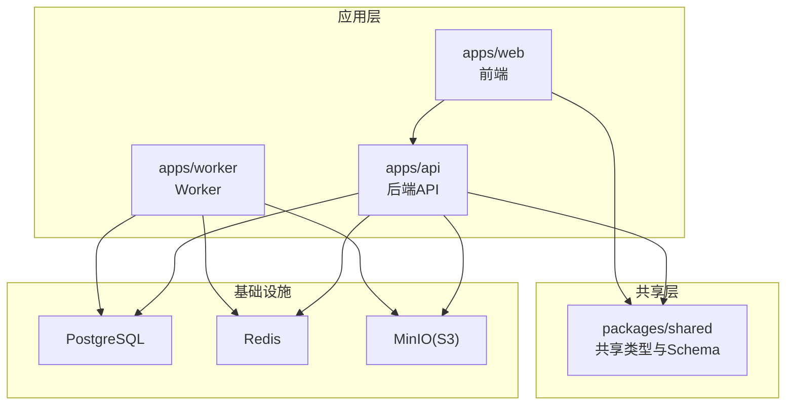
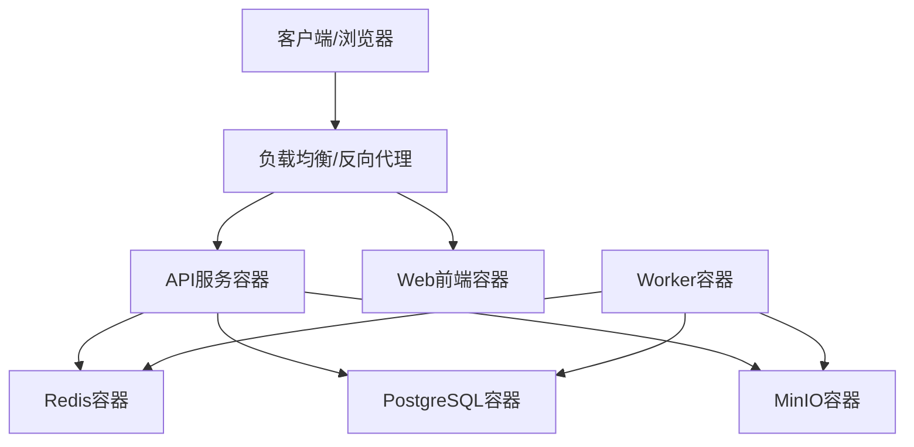
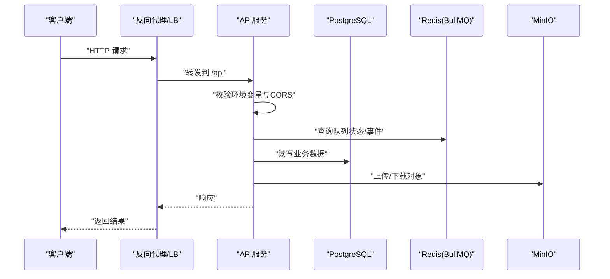
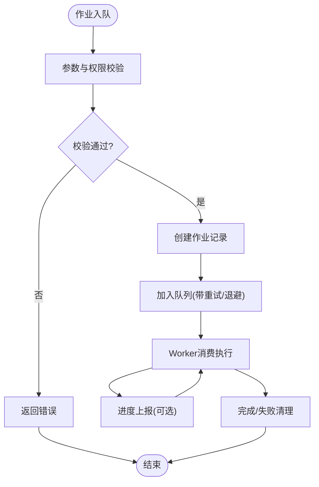
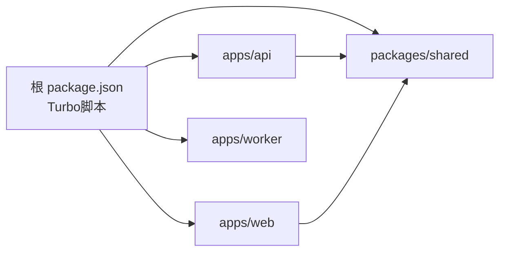

# 部署运维

<cite>
**本文引用的文件**
- [docker-compose.dev.yml](file://docker-compose.dev.yml)
- [apps/api/env.example](file://apps/api/env.example)
- [apps/api/ENVIRONMENT.md](file://apps/api/ENVIRONMENT.md)
- [apps/worker/env.example](file://apps/worker/env.example)
- [apps/worker/ENVIRONMENT.md](file://apps/worker/ENVIRONMENT.md)
- [apps/web/env.example](file://apps/web/env.example)
- [package.json](file://package.json)
- [pnpm-workspace.yaml](file://pnpm-workspace.yaml)
- [turbo.json](file://turbo.json)
- [README.md](file://README.md)
- [apps/api/src/main.ts](file://apps/api/src/main.ts)
- [apps/api/src/app.module.ts](file://apps/api/src/app.module.ts)
- [apps/api/src/config/env.ts](file://apps/api/src/config/env.ts)
- [apps/api/src/prisma/prisma.service.ts](file://apps/api/src/prisma/prisma.service.ts)
- [apps/api/src/crypto/api-key-crypto.service.ts](file://apps/api/src/crypto/api-key-crypto.service.ts)
- [apps/worker/src/crypto/apiKeyCrypto.ts](file://apps/worker/src/crypto/apiKeyCrypto.ts)
- [apps/api/src/jobs/jobs.service.ts](file://apps/api/src/jobs/jobs.service.ts)
</cite>

## 目录

1. [简介](#简介)
2. [项目结构](#项目结构)
3. [核心组件](#核心组件)
4. [架构总览](#架构总览)
5. [详细组件分析](#详细组件分析)
6. [依赖关系分析](#依赖关系分析)
7. [性能考量](#性能考量)
8. [故障排查指南](#故障排查指南)
9. [结论](#结论)
10. [附录](#附录)

## 简介

本文件面向AIXSSS项目的生产部署与运维，覆盖从环境准备、容器编排、配置与密钥管理、数据库迁移与备份、监控与日志、负载均衡与安全加固、到CI/CD流水线与自动化回滚的全链路方案。文档以仓库现有实现为基础，结合最佳实践给出可落地的部署运维建议。

## 项目结构

AIXSSS采用多包工作区（pnpm workspace）组织，核心模块包括：

- apps/api：NestJS后端API，负责鉴权、业务模型、队列化AI工作流调度
- apps/worker：BullMQ Worker，执行具体AI任务，不直接持有供应商密钥
- apps/web：React+Vite前端，提供可视化编辑与导出能力
- packages/shared：前后端共享类型与Zod校验Schema
- docs：工程与迁移文档

图表来源

- [pnpm-workspace.yaml](file://pnpm-workspace.yaml#L1-L6)
- [docker-compose.dev.yml](file://docker-compose.dev.yml#L1-L35)
- [apps/api/src/app.module.ts](file://apps/api/src/app.module.ts#L1-L37)

章节来源

- [pnpm-workspace.yaml](file://pnpm-workspace.yaml#L1-L6)
- [README.md](file://README.md#L63-L74)

## 核心组件

- 应用与运行时
  - API服务：基于NestJS/Fastify，通过ConfigModule加载并校验环境变量，启用CORS与全局异常过滤器，设置统一前缀与监听地址
  - Worker：消费BullMQ队列任务，执行AI生成与处理流程
  - Web：Vite构建的前端，支持本地代理到API
- 数据与缓存
  - PostgreSQL：持久化业务数据，Prisma管理连接生命周期
  - Redis：BullMQ队列与事件
  - MinIO：对象存储（S3兼容）
- 队列与作业
  - 通过JobsService封装队列操作，定义多种AI作业类型，统一重试与清理策略

章节来源

- [apps/api/src/main.ts](file://apps/api/src/main.ts#L9-L26)
- [apps/api/src/app.module.ts](file://apps/api/src/app.module.ts#L16-L35)
- [apps/api/src/config/env.ts](file://apps/api/src/config/env.ts#L3-L12)
- [apps/api/src/prisma/prisma.service.ts](file://apps/api/src/prisma/prisma.service.ts#L4-L13)
- [apps/api/src/jobs/jobs.service.ts](file://apps/api/src/jobs/jobs.service.ts#L37-L43)

## 架构总览

生产环境推荐采用容器化部署，API、Worker、Web分别作为独立服务，配合PostgreSQL、Redis、MinIO三类基础设施。API暴露REST接口，Worker从Redis队列拉取任务，Web通过反向代理访问API。

图表来源

- [docker-compose.dev.yml](file://docker-compose.dev.yml#L1-L35)
- [apps/api/src/main.ts](file://apps/api/src/main.ts#L16-L22)

## 详细组件分析

### API服务部署与配置

- 环境变量与校验
  - 使用Zod对环境变量进行强类型校验，强制要求关键字段如JWT密钥长度、加密密钥长度、数据库URL等
  - 支持CORS配置，生产环境建议限定来源
- 启动与网络
  - 绑定0.0.0.0，便于容器外部访问
  - 设置统一API前缀，便于反向代理与多服务共存
- 异常与可观测性
  - 全局异常过滤器，统一错误响应格式
  - 建议接入结构化日志与指标上报

图表来源

- [apps/api/src/main.ts](file://apps/api/src/main.ts#L9-L26)
- [apps/api/src/config/env.ts](file://apps/api/src/config/env.ts#L3-L12)
- [apps/api/src/prisma/prisma.service.ts](file://apps/api/src/prisma/prisma.service.ts#L4-L13)
- [apps/api/src/jobs/jobs.service.ts](file://apps/api/src/jobs/jobs.service.ts#L37-L43)

章节来源

- [apps/api/src/main.ts](file://apps/api/src/main.ts#L9-L26)
- [apps/api/src/config/env.ts](file://apps/api/src/config/env.ts#L3-L12)
- [apps/api/src/app.module.ts](file://apps/api/src/app.module.ts#L16-L35)

### Worker服务部署与配置

- 与API共享相同的加密密钥，确保能解密存储的第三方API密钥
- 并发度可通过环境变量控制，按资源与任务特性调整
- 建议与API同属一个网络，便于访问共享的Redis与数据库

章节来源

- [apps/worker/env.example](file://apps/worker/env.example#L1-L17)
- [apps/worker/ENVIRONMENT.md](file://apps/worker/ENVIRONMENT.md#L1-L25)
- [apps/worker/src/crypto/apiKeyCrypto.ts](file://apps/worker/src/crypto/apiKeyCrypto.ts#L1-L23)

### Web前端部署

- Vite构建产物可部署至静态Web服务器或CDN
- 通过环境变量切换数据模式（api/local）与API基础路径
- 生产环境建议开启HTTPS与严格安全头

章节来源

- [apps/web/env.example](file://apps/web/env.example#L1-L14)

### 数据库与队列

- PostgreSQL：PrismaClient生命周期管理，建议在容器编排中使用持久卷
- Redis：BullMQ队列，建议启用持久化与合理内存上限
- MinIO：S3兼容对象存储，建议启用TLS与访问控制

章节来源

- [docker-compose.dev.yml](file://docker-compose.dev.yml#L1-L35)
- [apps/api/src/prisma/prisma.service.ts](file://apps/api/src/prisma/prisma.service.ts#L4-L13)

### 敏感信息与密钥管理

- JWT密钥与API Key加密密钥均需满足最小长度要求
- 建议使用平台机密管理服务（如KMS、Vault）注入，避免硬编码
- 加密算法采用AEAD，确保完整性与保密性

章节来源

- [apps/api/src/config/env.ts](file://apps/api/src/config/env.ts#L7-L8)
- [apps/api/src/crypto/api-key-crypto.service.ts](file://apps/api/src/crypto/api-key-crypto.service.ts#L10-L15)
- [apps/worker/src/crypto/apiKeyCrypto.ts](file://apps/worker/src/crypto/apiKeyCrypto.ts#L3-L6)

### 队列与作业处理

- JobsService集中封装作业入队、状态查询与清理策略
- 为不同作业类型设置合理的重试次数与指数退避
- 建议对高耗时作业启用进度上报与超时控制

图表来源

- [apps/api/src/jobs/jobs.service.ts](file://apps/api/src/jobs/jobs.service.ts#L101-L149)
- [apps/api/src/jobs/jobs.service.ts](file://apps/api/src/jobs/jobs.service.ts#L364-L376)

章节来源

- [apps/api/src/jobs/jobs.service.ts](file://apps/api/src/jobs/jobs.service.ts#L37-L86)

## 依赖关系分析

- 工作区与脚本
  - pnpm workspace声明各包位置
  - Turbo统一管理构建、测试、类型检查与格式化任务
  - 根级脚本提供一键启动开发与打包
- 包间依赖
  - apps/api依赖packages/shared提供的Schema与类型
  - apps/web同样依赖shared，保证前后端一致性

图表来源

- [package.json](file://package.json#L7-L16)
- [turbo.json](file://turbo.json#L4-L28)
- [pnpm-workspace.yaml](file://pnpm-workspace.yaml#L1-L6)

章节来源

- [package.json](file://package.json#L1-L24)
- [turbo.json](file://turbo.json#L1-L30)
- [pnpm-workspace.yaml](file://pnpm-workspace.yaml#L1-L6)

## 性能考量

- 连接池与并发
  - Prisma连接池大小与数据库规格匹配，避免过度连接
  - Worker并发度按CPU与I/O瓶颈调优，避免与数据库争抢
- 缓存与队列
  - Redis内存上限与淘汰策略，避免OOM
  - 队列作业粒度拆分，避免单任务长时间占用
- 网络与存储
  - MinIO与数据库置于内网或同可用区，降低延迟
  - 对大文件传输启用压缩与断点续传（如适用）

## 故障排查指南

- 启动失败
  - 检查环境变量是否满足Zod校验（密钥长度、URL格式）
  - 查看全局异常过滤器输出的错误详情
- 数据库连接
  - 确认DATABASE_URL可达，网络连通与凭据正确
  - 如使用容器，确认卷与初始化脚本
- 队列无消费
  - 检查Redis连通性与队列名称一致性
  - 核对Worker进程与并发配置
- CORS与跨域
  - 生产环境限制CORS来源，避免通配符
- 日志与追踪
  - 启用结构化日志，结合请求ID定位问题
  - 对关键作业记录进度与耗时指标

章节来源

- [apps/api/src/config/env.ts](file://apps/api/src/config/env.ts#L3-L12)
- [apps/api/src/main.ts](file://apps/api/src/main.ts#L16-L22)
- [apps/api/src/prisma/prisma.service.ts](file://apps/api/src/prisma/prisma.service.ts#L4-L13)
- [apps/api/src/jobs/jobs.service.ts](file://apps/api/src/jobs/jobs.service.ts#L37-L43)

## 结论

AIXSSS具备清晰的模块边界与容器化部署基础。生产部署应围绕“安全、可靠、可观测、可回滚”的原则展开：强化密钥管理与网络隔离，完善监控与日志体系，规范CI/CD与回滚策略，并持续优化队列与数据库性能。

## 附录

### 生产环境部署清单

- 基础设施
  - PostgreSQL：主从/高可用、备份策略、只读副本
  - Redis：持久化、内存上限、哨兵/集群
  - MinIO：TLS、桶策略、版本控制
- 应用服务
  - API：健康检查端点、限流、WAF、HTTPS
  - Worker：资源限制、优雅退出、重试上限
  - Web：静态资源缓存、HTTPS、安全头
- 配置与密钥
  - 环境变量集中管理，区分环境
  - 敏感信息通过机密管理服务注入
- 监控与日志
  - 指标：CPU/内存/队列长度/数据库连接数/错误率
  - 日志：结构化、采样、归档
- 备份与灾备
  - 数据库定时快照与增量备份
  - 对象存储版本化与跨区域复制
- CI/CD与回滚
  - 自动化构建、测试、扫描
  - 蓝绿/金丝雀发布与一键回滚
- 安全加固
  - 最小权限、网络隔离、TLS 1.3、防爆破
  - 定期漏洞扫描与补丁更新

### 数据库迁移与备份

- 迁移
  - 开发/测试：使用迁移命令创建新迁移
  - 生产/CI：仅执行已存在迁移，不新增迁移
- 备份
  - 关系型：逻辑/物理快照，周期性验证恢复
  - 对象存储：版本化、生命周期策略、跨区域复制
- 灾难恢复
  - 制定RTO/RPO目标，定期演练恢复流程

章节来源

- [README.md](file://README.md#L35-L47)

### 负载均衡与SSL

- 反向代理：Nginx/Traefik，启用HTTP/2与压缩
- SSL：自动签发与续期（ACME），禁用弱密码套件
- 会话：后端无状态，必要时使用安全Cookie与SameSite

### CI/CD流水线建议

- 触发条件：分支保护、PR合并
- 步骤：安装依赖、构建、测试、静态分析、镜像构建、推送、部署、回滚策略
- 安全：镜像扫描、依赖审计、密钥注入与清理
