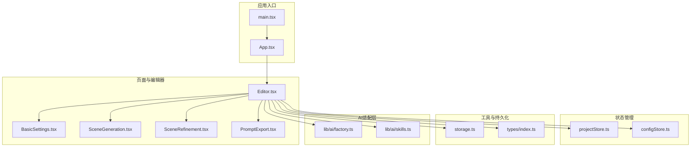
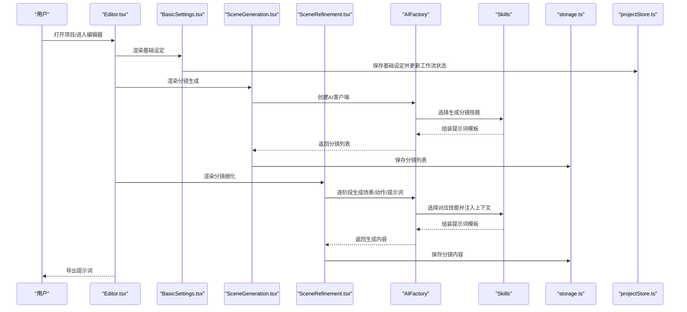
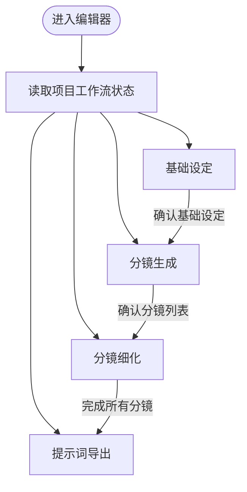
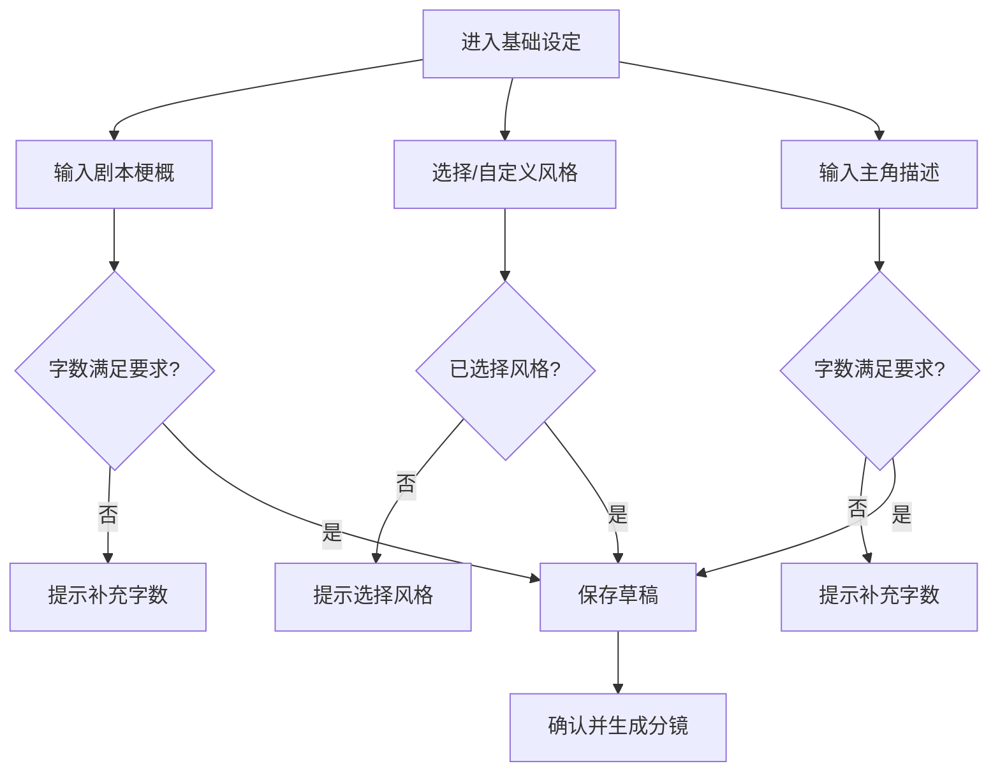
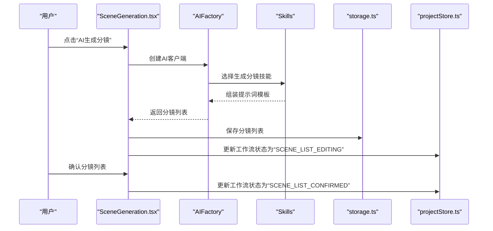
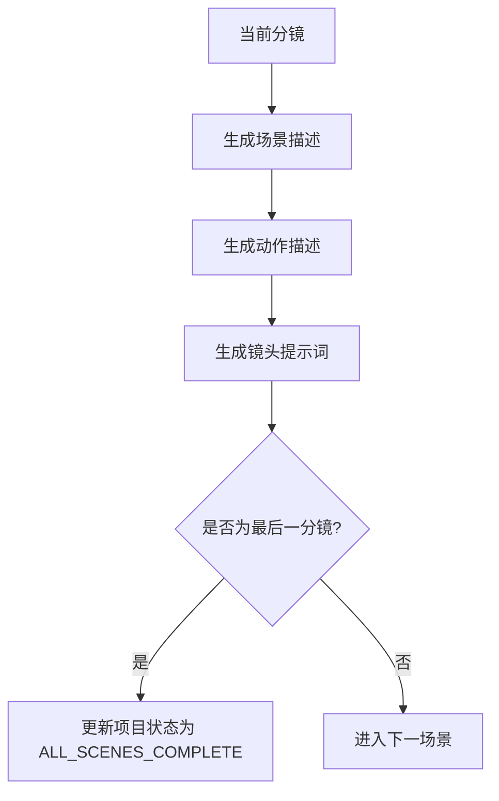
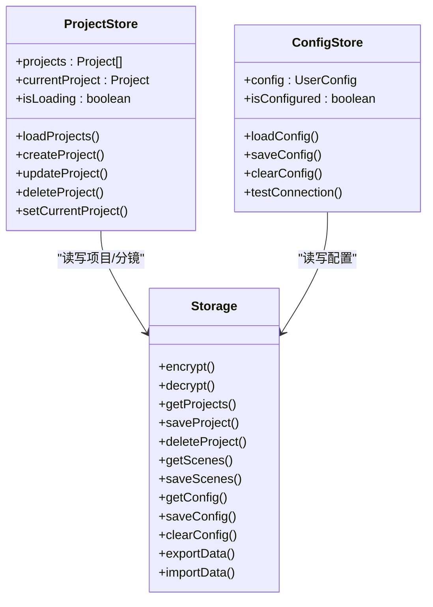
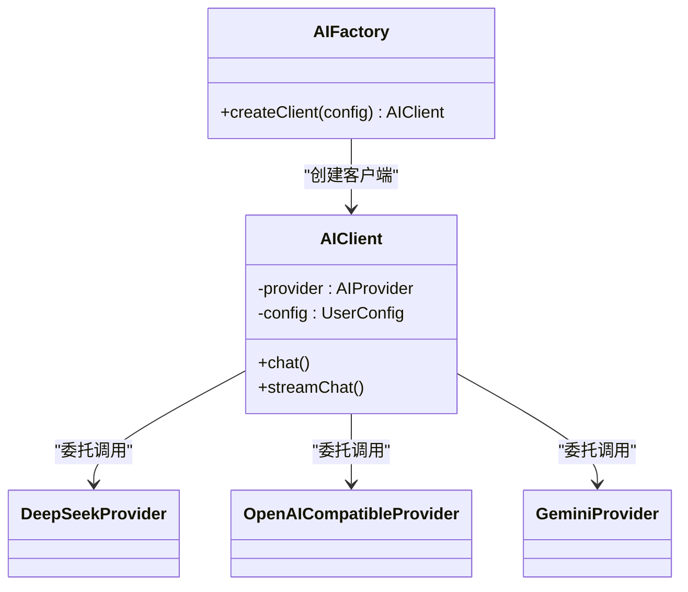
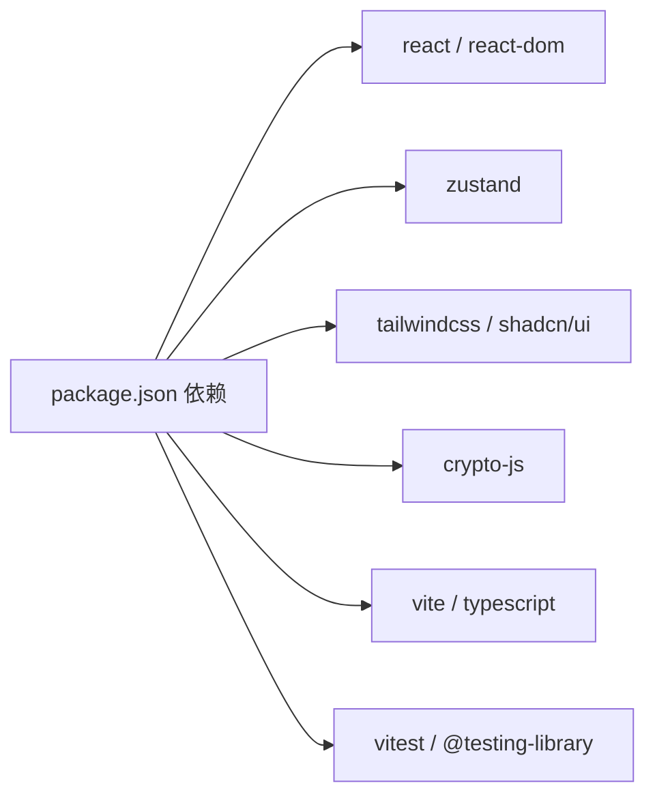

# 项目概述

<cite>
**本文档引用的文件**
- [README.md](file://manga-creator/README.md)
- [package.json](file://manga-creator/package.json)
- [App.tsx](file://manga-creator/src/App.tsx)
- [main.tsx](file://manga-creator/src/main.tsx)
- [Editor.tsx](file://manga-creator/src/components/Editor.tsx)
- [BasicSettings.tsx](file://manga-creator/src/components/editor/BasicSettings.tsx)
- [SceneGeneration.tsx](file://manga-creator/src/components/editor/SceneGeneration.tsx)
- [SceneRefinement.tsx](file://manga-creator/src/components/editor/SceneRefinement.tsx)
- [PromptExport.tsx](file://manga-creator/src/components/editor/PromptExport.tsx)
- [projectStore.ts](file://manga-creator/src/stores/projectStore.ts)
- [configStore.ts](file://manga-creator/src/stores/configStore.ts)
- [storage.ts](file://manga-creator/src/lib/storage.ts)
- [factory.ts](file://manga-creator/src/lib/ai/factory.ts)
- [skills.ts](file://manga-creator/src/lib/ai/skills.ts)
- [index.ts](file://manga-creator/src/types/index.ts)
- [ConfigDialog.tsx](file://manga-creator/src/components/ConfigDialog.tsx)
- [ProjectList.tsx](file://manga-creator/src/components/ProjectList.tsx)
- [ProjectCard.tsx](file://manga-creator/src/components/ProjectCard.tsx)
- [use-toast.ts](file://manga-creator/src/hooks/use-toast.ts)
- [prd_backup.md](file://prd_backup.md)
</cite>

## 目录
1. [引言](#引言)
2. [项目结构](#项目结构)
3. [核心组件](#核心组件)
4. [架构总览](#架构总览)
5. [详细组件分析](#详细组件分析)
6. [依赖分析](#依赖分析)
7. [性能考虑](#性能考虑)
8. [故障排查指南](#故障排查指南)
9. [结论](#结论)
10. [附录](#附录)

## 引言
漫剧创作助手是一个面向AI漫剧/短剧创作者的智能化创作引导系统，旨在通过渐进式引导与智能上下文管理，将创意想法系统化地转化为高质量、连贯的AIGC提示词，确保整部作品的视觉一致性。产品覆盖从“项目工作台”到“基础设定”“分镜生成”“分镜细化”“提示词导出”的完整创作闭环，支持多AI供应商接入与本地化配置，保障API Key的安全存储与传输。

- 产品定位与价值主张：以“渐进式披露”和“上下文工程”为核心设计原则，降低创作门槛，提升提示词质量与一致性。
- 用户画像：个人AI内容创作者、短视频/漫画脚本初学者、对AIGC叙事感兴趣的内容生产者。
- 典型使用场景：用户有一个故事点子，通过系统逐层构建（世界观→人物→剧本→剧集→分镜），最终生成可直接用于Midjourney/Stable Diffusion等平台的提示词集。
- 项目状态：MVP已完成，核心功能稳定可用，支持本地持久化与多供应商AI适配。

**章节来源**
- file://manga-creator/README.md#L1-L70
- file://prd_backup.md#L21-L31

## 项目结构
前端采用React 18 + TypeScript + Vite，UI基于Shadcn/ui与Tailwind CSS，状态管理使用Zustand，数据持久化采用LocalStorage并配合AES加密存储敏感配置。AI适配层采用工厂模式，支持DeepSeek/Kimi/Gemini/OpenAI兼容接口。

**图表来源**
- [main.tsx](file://manga-creator/src/main.tsx#L1-L11)
- [App.tsx](file://manga-creator/src/App.tsx#L1-L81)
- [Editor.tsx](file://manga-creator/src/components/Editor.tsx#L1-L172)
- [BasicSettings.tsx](file://manga-creator/src/components/editor/BasicSettings.tsx#L1-L224)
- [SceneGeneration.tsx](file://manga-creator/src/components/editor/SceneGeneration.tsx#L1-L383)
- [SceneRefinement.tsx](file://manga-creator/src/components/editor/SceneRefinement.tsx#L1-L638)
- [PromptExport.tsx](file://manga-creator/src/components/editor/PromptExport.tsx)
- [projectStore.ts](file://manga-creator/src/stores/projectStore.ts#L1-L95)
- [configStore.ts](file://manga-creator/src/stores/configStore.ts#L1-L58)
- [storage.ts](file://manga-creator/src/lib/storage.ts#L1-L246)
- [factory.ts](file://manga-creator/src/lib/ai/factory.ts#L1-L54)
- [skills.ts](file://manga-creator/src/lib/ai/skills.ts#L1-L132)
- [index.ts](file://manga-creator/src/types/index.ts#L1-L190)

**章节来源**
- file://manga-creator/README.md#L71-L128
- file://manga-creator/package.json#L1-L62

## 核心组件
- 项目工作台与编辑器：负责项目列表、创建/删除、打开编辑器、API配置弹窗、全局通知等。
- 基础设定模块：收集剧本梗概、风格选择、主角描述，提供字数校验与AI辅助提示。
- 分镜生成流程：AI生成8-12个分镜概要，支持编辑、删除、添加、重新生成与确认。
- 分镜细化工作流：三阶段渐进生成（场景描述→动作描述→镜头提示词），保持上下文连贯。
- 提示词导出：支持Markdown/JSON/纯提示词三种导出格式，一键复制与批量下载。
- 状态管理：Zustand管理项目、配置、分镜状态，自动持久化。
- 安全与适配：API Key AES加密存储，工厂模式适配多供应商，支持连接测试。

**章节来源**
- file://manga-creator/README.md#L11-L70
- file://manga-creator/src/components/Editor.tsx#L1-L172
- file://manga-creator/src/stores/projectStore.ts#L1-L95
- file://manga-creator/src/stores/configStore.ts#L1-L58
- file://manga-creator/src/lib/storage.ts#L1-L246
- file://manga-creator/src/lib/ai/factory.ts#L1-L54
- file://manga-creator/src/lib/ai/skills.ts#L1-L132

## 架构总览
系统采用“编辑器驱动的工作流”与“上下文工程策略”相结合的设计：
- 编辑器根据项目工作流状态自动切换步骤，确保创作流程可控。
- 上下文工程策略按需注入最小可用上下文，避免Context Rot，保证生成质量与效率。
- AI适配层通过工厂模式屏蔽供应商差异，支持扩展与替换。

**图表来源**
- [Editor.tsx](file://manga-creator/src/components/Editor.tsx#L1-L172)
- [BasicSettings.tsx](file://manga-creator/src/components/editor/BasicSettings.tsx#L1-L224)
- [SceneGeneration.tsx](file://manga-creator/src/components/editor/SceneGeneration.tsx#L1-L383)
- [SceneRefinement.tsx](file://manga-creator/src/components/editor/SceneRefinement.tsx#L1-L638)
- [factory.ts](file://manga-creator/src/lib/ai/factory.ts#L1-L54)
- [skills.ts](file://manga-creator/src/lib/ai/skills.ts#L1-L132)
- [storage.ts](file://manga-creator/src/lib/storage.ts#L1-L246)
- [projectStore.ts](file://manga-creator/src/stores/projectStore.ts#L1-L95)

## 详细组件分析

### 编辑器与工作流
- Editor根据项目工作流状态自动切换步骤，支持点击导航回到已完成或当前步骤。
- 通过自定义事件触发下一步，确保状态变更与UI同步。

**图表来源**
- [Editor.tsx](file://manga-creator/src/components/Editor.tsx#L1-L172)
- [index.ts](file://manga-creator/src/types/index.ts#L1-L60)

**章节来源**
- file://manga-creator/src/components/Editor.tsx#L1-L172
- file://manga-creator/src/types/index.ts#L1-L60

### 基础设定模块
- 收集剧本梗概（50-300字）、风格选择（6种预设+自定义描述）、主角描述（20-150字）。
- 实时字数统计与验证，支持保存草稿与确认进入下一步。
- 将基础设定写入项目并更新工作流状态。

**图表来源**
- [BasicSettings.tsx](file://manga-creator/src/components/editor/BasicSettings.tsx#L1-L224)

**章节来源**
- file://manga-creator/src/components/editor/BasicSettings.tsx#L1-L224

### 分镜生成流程
- AI根据项目上下文生成8-12个分镜概要，支持重新生成、手动添加、编辑与删除。
- 确认分镜列表后进入细化流程，自动保存并更新工作流状态。

**图表来源**
- [SceneGeneration.tsx](file://manga-creator/src/components/editor/SceneGeneration.tsx#L1-L383)
- [factory.ts](file://manga-creator/src/lib/ai/factory.ts#L1-L54)
- [skills.ts](file://manga-creator/src/lib/ai/skills.ts#L1-L132)
- [storage.ts](file://manga-creator/src/lib/storage.ts#L1-L246)
- [projectStore.ts](file://manga-creator/src/stores/projectStore.ts#L1-L95)

**章节来源**
- file://manga-creator/src/components/editor/SceneGeneration.tsx#L1-L383

### 分镜细化工作流
- 三阶段渐进生成：场景描述→动作描述→镜头提示词，每步支持重新生成与手动编辑。
- 保持上下文连贯：自动引用前一分镜摘要与已确认内容。
- 一键生成全部：按阶段顺序连续生成，最后更新项目状态为“ALL_SCENES_COMPLETE”。

**图表来源**
- [SceneRefinement.tsx](file://manga-creator/src/components/editor/SceneRefinement.tsx#L1-L638)
- [skills.ts](file://manga-creator/src/lib/ai/skills.ts#L1-L132)
- [projectStore.ts](file://manga-creator/src/stores/projectStore.ts#L1-L95)

**章节来源**
- file://manga-creator/src/components/editor/SceneRefinement.tsx#L1-L638

### 提示词导出
- 支持Markdown/JSON/纯提示词三种导出格式，一键复制到剪贴板，支持批量下载。
- 导出内容包含项目标题、风格、分镜概要、场景描述、动作描述与镜头提示词。

**章节来源**
- file://manga-creator/README.md#L49-L56
- file://manga-creator/src/components/editor/PromptExport.tsx

### 状态管理与持久化
- Zustand状态管理：项目状态、配置状态、分镜状态。
- LocalStorage持久化：项目列表、分镜数据、加密配置。
- 版本迁移：预留版本号与迁移逻辑，当前MVP阶段暂不实现具体迁移。

**图表来源**
- [projectStore.ts](file://manga-creator/src/stores/projectStore.ts#L1-L95)
- [configStore.ts](file://manga-creator/src/stores/configStore.ts#L1-L58)
- [storage.ts](file://manga-creator/src/lib/storage.ts#L1-L246)

**章节来源**
- file://manga-creator/src/stores/projectStore.ts#L1-L95
- file://manga-creator/src/stores/configStore.ts#L1-L58
- file://manga-creator/src/lib/storage.ts#L1-L246

### AI适配层与技能系统
- 工厂模式：根据供应商类型创建适配器，统一对接不同API格式与认证方式。
- 技能系统：定义分镜列表生成、场景描述、动作描述、镜头提示词生成等技能，按需组装上下文与提示词模板。

**图表来源**
- [factory.ts](file://manga-creator/src/lib/ai/factory.ts#L1-L54)

**章节来源**
- file://manga-creator/src/lib/ai/factory.ts#L1-L54
- file://manga-creator/src/lib/ai/skills.ts#L1-L132
- file://manga-creator/src/types/index.ts#L118-L160

## 依赖分析
- 前端框架与工具链：React 18、TypeScript 5.6、Vite 5、Tailwind CSS 3.4、Shadcn/ui、Zustand 4.5、crypto-js 4.2。
- 运行与测试：开发服务器、构建、测试（Vitest）、覆盖率（Vitest coverage）。
- 依赖关系：应用入口依赖App组件；App组件依赖编辑器与配置弹窗；编辑器依赖状态管理、存储与AI适配层；AI适配层依赖技能定义与类型系统。

**图表来源**
- [package.json](file://manga-creator/package.json#L1-L62)

**章节来源**
- file://manga-creator/package.json#L1-L62

## 性能考虑
- 渐进式披露与上下文工程：按需注入上下文，避免一次性加载过多内容，降低Token消耗与生成延迟。
- 本地持久化：LocalStorage减少网络往返，提高交互流畅度；加密存储API Key避免泄露风险。
- 并发与批处理：细化阶段支持一键生成全部，内部按阶段顺序串行执行，避免竞态与状态不一致。
- UI反馈：生成过程提供进度条与状态徽章，提升用户感知与操作信心。

[本节为通用指导，无需特定文件来源]

## 故障排查指南
- API配置问题：检查供应商、API Key、BaseURL与模型是否正确；使用“连接测试”验证可用性。
- 生成失败：查看错误提示，确认网络连通与供应商可用性；必要时重新生成或更换供应商。
- 数据丢失：确认LocalStorage可用且未被清理；使用导出/导入功能备份与恢复数据。
- 项目状态异常：检查工作流状态流转是否符合预期，必要时手动重置或重新创建项目。

**章节来源**
- file://manga-creator/src/stores/configStore.ts#L1-L58
- file://manga-creator/src/lib/storage.ts#L1-L246
- file://manga-creator/src/components/editor/SceneGeneration.tsx#L1-L383
- file://manga-creator/src/components/editor/SceneRefinement.tsx#L1-L638

## 结论
漫剧创作助手以“渐进式引导+智能上下文管理”为核心，构建了从剧本到分镜再到提示词的完整创作闭环。MVP已完成，具备稳定的项目管理、API配置、分镜生成与导出能力。未来规划包括历史版本管理、世界观构建模块、角色管理系统、批量生成优化与云端同步等，持续提升创作效率与一致性。

**章节来源**
- file://manga-creator/README.md#L57-L88
- file://manga-creator/README.md#L170-L183
- file://prd_backup.md#L380-L407

## 附录
- 产品PRD要点：明确用户画像、创作流程、上下文工程策略、Agent智能体架构、AI适配层与安全策略。
- 设计系统：主色调、背景色、文字色与设计原则（渐进式披露、卡片化布局、响应式设计）。
- 快速开始：安装依赖、启动开发服务器、构建生产版本。

**章节来源**
- file://manga-creator/README.md#L129-L189
- file://prd_backup.md#L1-L120