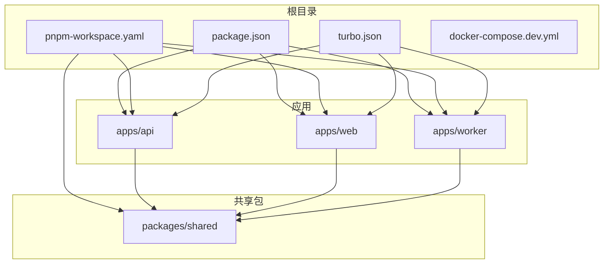
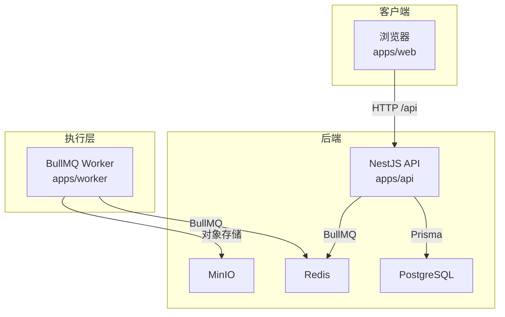
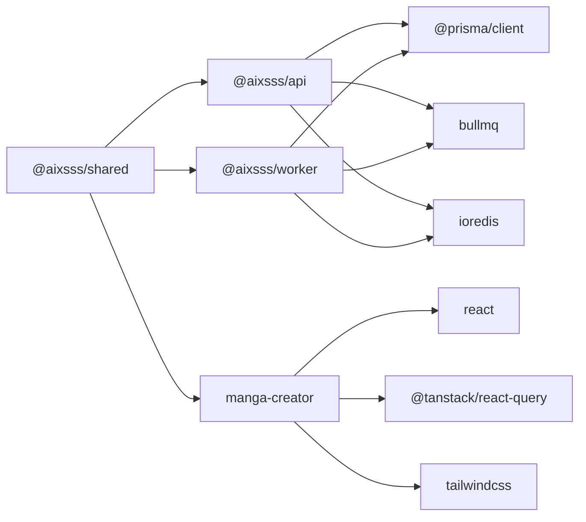

# 快速开始指南

<cite>
**本文引用的文件**
- [README.md](file://README.md)
- [package.json](file://package.json)
- [pnpm-workspace.yaml](file://pnpm-workspace.yaml)
- [docker-compose.dev.yml](file://docker-compose.dev.yml)
- [turbo.json](file://turbo.json)
- [apps/api/env.example](file://apps/api/env.example)
- [apps/worker/env.example](file://apps/worker/env.example)
- [apps/web/env.example](file://apps/web/env.example)
- [apps/api/ENVIRONMENT.md](file://apps/api/ENVIRONMENT.md)
- [apps/worker/ENVIRONMENT.md](file://apps/worker/ENVIRONMENT.md)
- [apps/api/package.json](file://apps/api/package.json)
- [apps/worker/package.json](file://apps/worker/package.json)
- [apps/web/package.json](file://apps/web/package.json)
- [apps/api/prisma/schema.prisma](file://apps/api/prisma/schema.prisma)
- [apps/api/prisma/migrations/migration_lock.toml](file://apps/api/prisma/migrations/migration_lock.toml)
</cite>

## 目录

1. [简介](#简介)
2. [项目结构](#项目结构)
3. [核心组件](#核心组件)
4. [架构总览](#架构总览)
5. [详细组件分析](#详细组件分析)
6. [依赖关系分析](#依赖关系分析)
7. [性能注意事项](#性能注意事项)
8. [故障排除指南](#故障排除指南)
9. [结论](#结论)
10. [附录](#附录)

## 简介

本指南面向希望在本地快速搭建并运行 AIXSSS 平台的开发者与技术爱好者。平台采用多包工作空间（pnpm workspace）组织，包含三个主要应用：Web 前端、NestJS API 后端与 BullMQ Worker。后端通过 Prisma 连接 PostgreSQL，使用 Redis 存储队列任务，MinIO 提供对象存储能力。本指南将带你完成环境准备、依赖安装、数据库与 Redis/MinIO 服务启动、环境变量配置、数据库迁移以及三模块并行开发启动的全流程，并提供常见问题排查与验证步骤。

## 项目结构

项目采用 pnpm workspace + Turbo 引擎进行统一开发与构建管理，核心目录如下：

- apps/web：React + Vite 前端应用
- apps/api：NestJS API 应用（鉴权、项目/分镜/AI 配置、工作流）
- apps/worker：BullMQ Worker（执行 AI 任务）
- packages/shared：前后端共享类型与 Zod Schema
- docs：审计/工程/迁移文档
- 根级配置：package.json、pnpm-workspace.yaml、turbo.json、docker-compose.dev.yml

图表来源

- [pnpm-workspace.yaml](file://pnpm-workspace.yaml#L1-L6)
- [package.json](file://package.json#L1-L24)
- [turbo.json](file://turbo.json#L1-L30)

章节来源

- [README.md](file://README.md#L63-L74)
- [pnpm-workspace.yaml](file://pnpm-workspace.yaml#L1-L6)
- [package.json](file://package.json#L1-L24)
- [turbo.json](file://turbo.json#L1-L30)

## 核心组件

- Web 前端：基于 Vite + React，提供分镜编辑与导出界面，支持本地/云端两种数据模式。
- API 后端：基于 NestJS + Fastify，提供鉴权、项目/分镜存储、队列化 AI 工作流等能力。
- Worker：基于 BullMQ，消费队列任务并执行 AI 生成与处理逻辑。
- 共享包：统一前后端类型定义与 Zod Schema，保证数据契约一致性。

章节来源

- [apps/web/package.json](file://apps/web/package.json#L1-L95)
- [apps/api/package.json](file://apps/api/package.json#L1-L52)
- [apps/worker/package.json](file://apps/worker/package.json#L1-L35)
- [packages/shared/package.json](file://packages/shared/package.json#L1-L200)

## 架构总览

平台整体采用“前端-后端-队列-数据库/对象存储”的分层架构。前端通过 Vite 代理访问后端 API；后端使用 Prisma 连接 PostgreSQL，使用 Redis 存储队列；Worker 从 Redis 队列拉取任务并执行；MinIO 提供对象存储能力。

图表来源

- [docker-compose.dev.yml](file://docker-compose.dev.yml#L1-L35)
- [apps/api/package.json](file://apps/api/package.json#L18-L36)
- [apps/worker/package.json](file://apps/worker/package.json#L14-L22)

## 详细组件分析

### 环境准备与依赖安装

- 安装 pnpm（推荐版本见根 package.json 中的 packageManager 字段）
- 在项目根目录执行依赖安装
- 构建共享包（首次或共享包代码变更后必须执行）

章节来源

- [README.md](file://README.md#L7-L20)
- [package.json](file://package.json#L6-L7)

### 依赖服务启动（Postgres / Redis / MinIO）

使用 docker-compose 启动开发所需的数据库、缓存与对象存储服务，并映射必要端口。

章节来源

- [README.md](file://README.md#L21-L26)
- [docker-compose.dev.yml](file://docker-compose.dev.yml#L1-L35)

### 环境变量配置

- API 应用：在 apps/api 下创建 .env 文件，至少包含数据库、JWT、API Key 加密、Redis、CORS 等关键变量
- Worker 应用：在 apps/worker 下创建 .env 文件，与 API 保持一致的数据库、加密密钥、Redis、队列名称与并发参数
- Web 应用（Vite）：在 apps/web 下配置 VITE_DATA_MODE 与 VITE_API_BASE_PATH

章节来源

- [apps/api/ENVIRONMENT.md](file://apps/api/ENVIRONMENT.md#L1-L31)
- [apps/worker/ENVIRONMENT.md](file://apps/worker/ENVIRONMENT.md#L1-L25)
- [apps/api/env.example](file://apps/api/env.example#L1-L23)
- [apps/worker/env.example](file://apps/worker/env.example#L1-L17)
- [apps/web/env.example](file://apps/web/env.example#L1-L14)

### 数据库迁移与 Prisma 使用

- 首次初始化：在 apps/api/.env 配置 DATABASE_URL 后，执行迁移命令
- 生产/CI 部署：仅应用现有迁移，不创建新迁移

章节来源

- [README.md](file://README.md#L35-L47)
- [apps/api/package.json](file://apps/api/package.json#L13-L16)
- [apps/api/prisma/schema.prisma](file://apps/api/prisma/schema.prisma#L1-L10)

### 三模块并行启动

- 统一开发：在根目录执行 pnpm dev，由 Turbo 并行启动 web、api、worker
- 分别启动：也可分别进入各应用目录执行 dev 脚本

章节来源

- [README.md](file://README.md#L49-L61)
- [package.json](file://package.json#L7-L8)
- [turbo.json](file://turbo.json#L4-L8)

### 开发环境验证

- 启动完成后，打开浏览器访问前端地址（Vite 默认端口），确认能加载页面
- 在前端切换到 API 模式，检查是否能连接后端 /api 接口
- 在后端控制台观察日志，确认 Prisma 连接与队列初始化正常
- 在 Worker 控制台观察日志，确认队列消费者已启动

章节来源

- [README.md](file://README.md#L49-L61)
- [apps/web/package.json](file://apps/web/package.json#L7-L21)
- [apps/api/package.json](file://apps/api/package.json#L6-L10)
- [apps/worker/package.json](file://apps/worker/package.json#L6-L13)

## 依赖关系分析

- 工作空间与脚手架
  - pnpm workspace 将 apps 与 packages 纳入同一管理范围
  - Turbo 作为任务编排引擎，定义 dev/build/typecheck/lint/test/format 等任务依赖关系
- 应用间依赖
  - apps/api 与 apps/worker 依赖 packages/shared
  - apps/web 依赖 packages/shared
- 外部依赖
  - API 与 Worker 依赖 Prisma、BullMQ、ioredis 等
  - Web 依赖 React、TanStack Query、TailwindCSS 等

图表来源

- [pnpm-workspace.yaml](file://pnpm-workspace.yaml#L1-L6)
- [apps/api/package.json](file://apps/api/package.json#L18-L36)
- [apps/worker/package.json](file://apps/worker/package.json#L14-L22)
- [apps/web/package.json](file://apps/web/package.json#L22-L63)

章节来源

- [pnpm-workspace.yaml](file://pnpm-workspace.yaml#L1-L6)
- [turbo.json](file://turbo.json#L4-L28)
- [apps/api/package.json](file://apps/api/package.json#L18-L36)
- [apps/worker/package.json](file://apps/worker/package.json#L14-L22)
- [apps/web/package.json](file://apps/web/package.json#L22-L63)

## 性能注意事项

- 并发与队列
  - Worker 并发可通过环境变量调整，合理设置以平衡吞吐与资源占用
- 缓存与持久化
  - Redis 作为队列与缓存介质，建议独立部署并监控内存与持久化策略
- 数据库
  - 合理索引与查询优化，避免长事务与热点表
- 前端
  - Tailwind/Turbo 打包优化，按需加载与懒编译提升开发体验

## 故障排除指南

- 本地回环解析问题（IPv6）
  - Windows/Docker Desktop 环境中，若 localhost 解析到 IPv6 导致连接异常，请改用 127.0.0.1
- 数据库连接失败
  - 确认 docker-compose 已正确启动 Postgres，并检查 DATABASE_URL 与容器端口映射
- Redis 连接失败
  - 确认 Redis 服务已启动，REDIS_URL 正确，且与 API/Worker 配置一致
- API Key 加密不一致
  - API 与 Worker 的 API_KEY_ENCRYPTION_KEY 必须保持一致，否则无法解密 AI 配置
- 数据库迁移卡住
  - 检查 migration_lock.toml 是否存在残留锁，必要时清理并重新执行迁移
- 前端无法代理到后端
  - 确认 VITE_API_BASE_PATH 与后端 /api 前缀一致，Vite 代理配置正确

章节来源

- [apps/api/ENVIRONMENT.md](file://apps/api/ENVIRONMENT.md#L28-L31)
- [apps/worker/ENVIRONMENT.md](file://apps/worker/ENVIRONMENT.md#L22-L25)
- [docker-compose.dev.yml](file://docker-compose.dev.yml#L1-L35)
- [apps/api/prisma/migrations/migration_lock.toml](file://apps/api/prisma/migrations/migration_lock.toml#L1-L200)

## 结论

通过本指南，你可以在本地完成 AIXSSS 平台的完整搭建：安装依赖、启动数据库与缓存、配置环境变量、执行数据库迁移，并以 Turbo 并行方式启动前端、后端与 Worker。遇到问题时，可依据故障排除指南逐项排查。完成上述步骤后，即可进入日常开发与调试流程。

## 附录

- 本地数据迁移（local → api）
  - 当 Web 处于 API 模式且检测到浏览器存在旧本地项目数据时，项目列表页会提示“导入到云端”，导入内容包含项目与分镜核心数据，角色/世界观等仍保持本地

章节来源

- [README.md](file://README.md#L75-L83)
