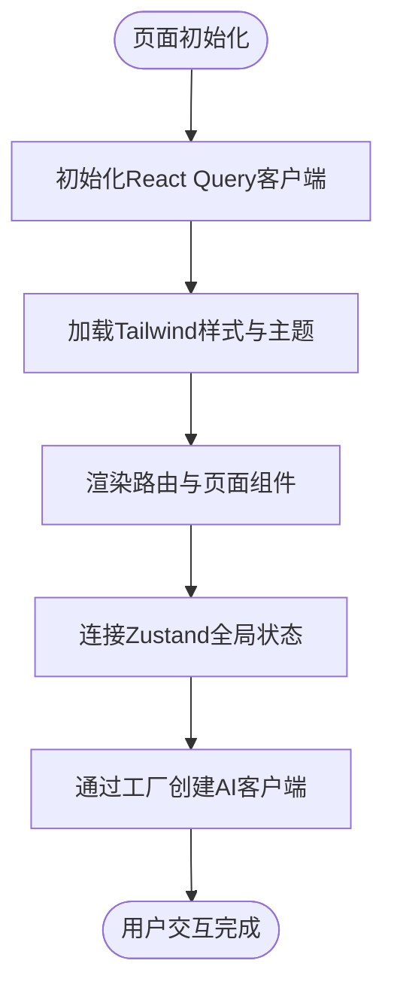

# 技术栈概览

<cite>
**本文档引用的文件**
- [package.json](file://package.json)
- [turbo.json](file://turbo.json)
- [pnpm-workspace.yaml](file://pnpm-workspace.yaml)
- [apps/api/package.json](file://apps/api/package.json)
- [apps/api/tsconfig.json](file://apps/api/tsconfig.json)
- [apps/api/src/app.module.ts](file://apps/api/src/app.module.ts)
- [apps/api/src/jobs/jobs.service.ts](file://apps/api/src/jobs/jobs.service.ts)
- [apps/api/prisma/schema.prisma](file://apps/api/prisma/schema.prisma)
- [apps/web/package.json](file://apps/web/package.json)
- [apps/web/tsconfig.json](file://apps/web/tsconfig.json)
- [apps/web/vite.config.ts](file://apps/web/vite.config.ts)
- [apps/web/tailwind.config.js](file://apps/web/tailwind.config.js)
- [apps/web/src/main.tsx](file://apps/web/src/main.tsx)
- [apps/web/src/lib/ai/factory.ts](file://apps/web/src/lib/ai/factory.ts)
- [apps/web/src/lib/ai/types.ts](file://apps/web/src/lib/ai/types.ts)
- [apps/web/src/lib/ai/providers/backend.ts](file://apps/web/src/lib/ai/providers/backend.ts)
- [apps/worker/package.json](file://apps/worker/package.json)
- [apps/worker/src/worker.ts](file://apps/worker/src/worker.ts)
</cite>

## 目录

1. [简介](#简介)
2. [项目结构](#项目结构)
3. [核心组件](#核心组件)
4. [架构总览](#架构总览)
5. [详细组件分析](#详细组件分析)
6. [依赖关系分析](#依赖关系分析)
7. [性能考量](#性能考量)
8. [故障排查指南](#故障排查指南)
9. [结论](#结论)

## 简介

本文件面向AIXSSS平台的技术栈概览，系统梳理前端（React 18、TypeScript、Vite、Zustand、TailwindCSS、React Flow）、后端（NestJS、Fastify、Prisma、BullMQ）、数据库与缓存（PostgreSQL、Redis）、以及AI服务集成（OpenAI、Gemini、DeepSeek、Kimi、Doubao Ark）等关键技术选型与实现要点。文档同时给出版本信息、兼容性要求、性能优化建议与最佳实践，帮助开发者快速理解并高效迭代。

## 项目结构

AIXSSS采用多包工作区（pnpm monorepo）组织，包含三个应用与一个共享包：

- apps/api：基于NestJS + Fastify的后端服务，负责业务接口、作业调度与数据持久化
- apps/web：基于React 18 + TypeScript的前端应用，使用Vite构建、TailwindCSS样式体系与Zustand状态管理
- apps/worker：基于BullMQ的异步任务执行器，承接后端下发的AI生成与处理任务
- packages/shared：跨应用共享的类型与Schema定义

图表来源

- [apps/api/src/app.module.ts](file://apps/api/src/app.module.ts#L16-L35)
- [apps/api/prisma/schema.prisma](file://apps/api/prisma/schema.prisma#L5-L8)
- [apps/api/package.json](file://apps/api/package.json#L18-L36)
- [apps/web/package.json](file://apps/web/package.json#L22-L62)
- [apps/worker/package.json](file://apps/worker/package.json#L14-L22)

章节来源

- [pnpm-workspace.yaml](file://pnpm-workspace.yaml#L1-L6)
- [turbo.json](file://turbo.json#L1-L30)
- [package.json](file://package.json#L1-L24)

## 核心组件

- 前端技术栈
  - React 18：组件化UI与并发渲染能力
  - TypeScript：强类型保障与更好的开发体验
  - Vite：极速开发与构建工具链
  - Zustand：轻量级状态管理
  - TailwindCSS：原子化样式与主题定制
  - React Flow：可视化流程编辑
- 后端技术栈
  - NestJS + Fastify：高性能Web框架与插件生态
  - Prisma：类型安全的ORM与数据库迁移
  - BullMQ：分布式任务队列与作业生命周期管理
- 数据与缓存
  - PostgreSQL：关系型数据存储
  - Redis：队列与缓存
- AI服务集成
  - OpenAI、Gemini、DeepSeek、Kimi、Doubao Ark：多供应商适配与统一抽象

章节来源

- [apps/web/package.json](file://apps/web/package.json#L22-L62)
- [apps/api/package.json](file://apps/api/package.json#L18-L36)
- [apps/worker/package.json](file://apps/worker/package.json#L14-L22)
- [apps/api/prisma/schema.prisma](file://apps/api/prisma/schema.prisma#L5-L8)

## 架构总览

AIXSSS采用前后端分离与异步任务解耦的设计：

- 前端通过HTTP与后端交互，使用Zustand管理本地状态，TailwindCSS提供一致的视觉语言
- 后端以NestJS承载REST接口，使用Prisma访问PostgreSQL，使用BullMQ管理异步作业
- Worker进程从Redis队列拉取任务，执行AI生成与处理逻辑，最终回写数据库状态

图表来源

- [apps/api/src/jobs/jobs.service.ts](file://apps/api/src/jobs/jobs.service.ts#L101-L149)
- [apps/worker/src/worker.ts](file://apps/worker/src/worker.ts#L50-L729)
- [apps/api/prisma/schema.prisma](file://apps/api/prisma/schema.prisma#L311-L335)

## 详细组件分析

### 前端技术栈

- React 18 + TypeScript
  - 使用严格编译选项与装饰器元数据支持，确保类型安全与现代化语法
- Vite
  - 开发服务器代理至后端3001端口，构建期进行代码分割与依赖预构建，生产环境启用esbuild压缩与CSS分割
- Zustand
  - 全局状态集中管理，结合React Query进行服务端状态同步
- TailwindCSS
  - 自定义主题、动画与阴影，支持深色模式与中英文字体体系
- React Flow
  - 流程图节点与连线，支撑叙事因果链与工作流可视化

图表来源

- [apps/web/src/main.tsx](file://apps/web/src/main.tsx#L13-L36)
- [apps/web/vite.config.ts](file://apps/web/vite.config.ts#L24-L93)
- [apps/web/tailwind.config.js](file://apps/web/tailwind.config.js#L1-L216)

章节来源

- [apps/web/package.json](file://apps/web/package.json#L22-L62)
- [apps/web/tsconfig.json](file://apps/web/tsconfig.json#L1-L11)
- [apps/web/vite.config.ts](file://apps/web/vite.config.ts#L1-L94)
- [apps/web/tailwind.config.js](file://apps/web/tailwind.config.js#L1-L216)
- [apps/web/src/main.tsx](file://apps/web/src/main.tsx#L1-L37)

### 后端技术栈

- NestJS + Fastify
  - 以模块化方式组织认证、项目、场景、角色扮演、作业等子域，统一配置校验与异常过滤
- Prisma
  - 类型安全的数据库建模与迁移，支持PostgreSQL
- BullMQ
  - 作业入队、重试、进度上报与事件监听，配合Redis实现高可用队列

图表来源

- [apps/api/src/app.module.ts](file://apps/api/src/app.module.ts#L16-L35)
- [apps/api/src/jobs/jobs.service.ts](file://apps/api/src/jobs/jobs.service.ts#L37-L43)

章节来源

- [apps/api/package.json](file://apps/api/package.json#L18-L36)
- [apps/api/tsconfig.json](file://apps/api/tsconfig.json#L1-L21)
- [apps/api/src/app.module.ts](file://apps/api/src/app.module.ts#L1-L37)
- [apps/api/src/jobs/jobs.service.ts](file://apps/api/src/jobs/jobs.service.ts#L1-L1055)

### 数据库与缓存

- PostgreSQL
  - 通过Prisma Schema定义实体关系，涵盖用户、团队、项目、剧集、场景、角色、世界观、AI作业与系统提示等
- Redis
  - 作为BullMQ队列后端，提供作业锁、心跳检测与任务持久化

图表来源

- [apps/api/prisma/schema.prisma](file://apps/api/prisma/schema.prisma#L75-L350)

章节来源

- [apps/api/prisma/schema.prisma](file://apps/api/prisma/schema.prisma#L1-L351)

### AI服务集成与统一抽象

- 抽象层
  - 通过AIProvider接口与工厂方法，屏蔽不同供应商差异，支持本地直连与后端转发两种模式
- 供应商适配
  - 支持DeepSeek、Kimi、Gemini、OpenAI兼容、Doubao Ark等
- 后端模式
  - 前端不直接持有密钥，通过aiProfileId与后端交互，由后端根据配置调用对应供应商

图表来源

- [apps/web/src/lib/ai/types.ts](file://apps/web/src/lib/ai/types.ts#L1-L30)
- [apps/web/src/lib/ai/factory.ts](file://apps/web/src/lib/ai/factory.ts#L1-L98)
- [apps/web/src/lib/ai/providers/backend.ts](file://apps/web/src/lib/ai/providers/backend.ts#L1-L25)

章节来源

- [apps/web/src/lib/ai/types.ts](file://apps/web/src/lib/ai/types.ts#L1-L30)
- [apps/web/src/lib/ai/factory.ts](file://apps/web/src/lib/ai/factory.ts#L1-L98)
- [apps/web/src/lib/ai/providers/backend.ts](file://apps/web/src/lib/ai/providers/backend.ts#L1-L25)

### 异步任务执行器（Worker）

- Worker职责
  - 从Redis队列拉取作业，执行具体AI任务（如场景生成、关键帧、对白、视频等），并更新数据库状态
- 重试与进度
  - 支持指数退避与最大重试次数；协作式取消避免无效计算；进度通过updateProgress上报
- 并发与稳定性
  - 可配置并发度，设置锁时长与stalled检测，提升稳定性

图表来源

- [apps/worker/src/worker.ts](file://apps/worker/src/worker.ts#L50-L729)

章节来源

- [apps/worker/package.json](file://apps/worker/package.json#L14-L22)
- [apps/worker/src/worker.ts](file://apps/worker/src/worker.ts#L1-L755)

## 依赖关系分析

- 包管理与工作区
  - pnpm monorepo + Turbo构建管线，统一脚本与任务依赖
- 应用间依赖
  - apps/web与apps/worker均依赖packages/shared，保证类型与Schema一致性
- 外部依赖
  - 前端：React 18、Zustand、TailwindCSS、React Flow等
  - 后端：NestJS、Fastify、Prisma、BullMQ、ioredis等
  - 任务执行：BullMQ、ioredis、Prisma Client

图表来源

- [pnpm-workspace.yaml](file://pnpm-workspace.yaml#L1-L6)
- [apps/web/package.json](file://apps/web/package.json#L22-L23)
- [apps/api/package.json](file://apps/api/package.json#L19-L27)
- [apps/worker/package.json](file://apps/worker/package.json#L15-L21)

章节来源

- [pnpm-workspace.yaml](file://pnpm-workspace.yaml#L1-L6)
- [turbo.json](file://turbo.json#L1-L30)
- [package.json](file://package.json#L1-L24)

## 性能考量

- 前端性能
  - 代码分割策略：将React核心、Radix UI、图表、拖拽、工具库、加密压缩等独立分包，减少首屏体积
  - 依赖预构建：对常用库进行预构建，缩短冷启动时间
  - 生产环境移除console与esbuild压缩，降低包体与运行时开销
  - TailwindCSS按需扫描与CSS分割，避免无用样式
- 后端性能
  - NestJS + Fastify在高并发下具备较低延迟与内存占用
  - Prisma查询优化与索引设计（Schema中多处索引）有助于提升读写效率
- 队列与任务
  - BullMQ支持重试与进度上报，合理配置attempts/backoff与并发度，平衡吞吐与稳定性
  - 协作式取消避免无效计算，提升资源利用率

章节来源

- [apps/web/vite.config.ts](file://apps/web/vite.config.ts#L36-L93)
- [apps/api/src/jobs/jobs.service.ts](file://apps/api/src/jobs/jobs.service.ts#L136-L146)
- [apps/worker/src/worker.ts](file://apps/worker/src/worker.ts#L721-L729)

## 故障排查指南

- 常见问题定位
  - 队列作业失败：检查后端日志与BullMQ事件，确认attempts与backoff是否生效
  - 作业被取消：确认前端是否主动取消，或Worker检测到最新状态为cancelled
  - 数据库连接：核对DATABASE_URL与PostgreSQL可达性
  - 队列后端：核对REDIS_URL协议与密码，确认Redis可用
- 建议排查步骤
  - 查看Worker启动日志与失败事件
  - 在API侧查询作业状态与错误字段
  - 检查Prisma迁移与Schema变更是否一致
  - 校验AI供应商配置与密钥加密流程

章节来源

- [apps/worker/src/worker.ts](file://apps/worker/src/worker.ts#L731-L749)
- [apps/api/src/jobs/jobs.service.ts](file://apps/api/src/jobs/jobs.service.ts#L88-L99)
- [apps/api/prisma/schema.prisma](file://apps/api/prisma/schema.prisma#L5-L8)

## 结论

AIXSSS通过现代前端技术栈与NestJS后端架构，结合BullMQ异步任务与Prisma数据库，构建了可扩展、可观测且易维护的AI内容创作平台。统一的AI抽象层与多供应商适配，使得平台在功能演进与成本优化上具备高度灵活性。建议在后续迭代中持续关注包体积与队列并发配置，以进一步提升用户体验与系统稳定性。
