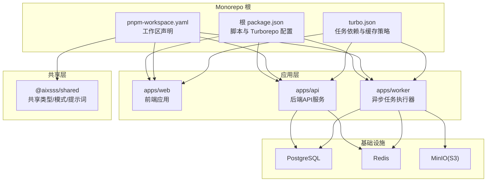
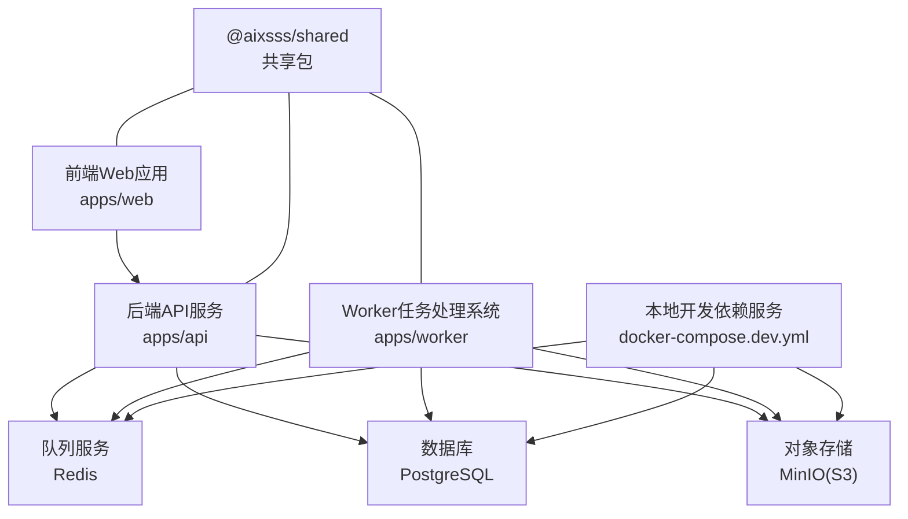
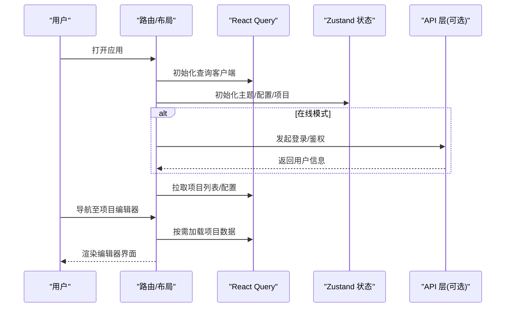
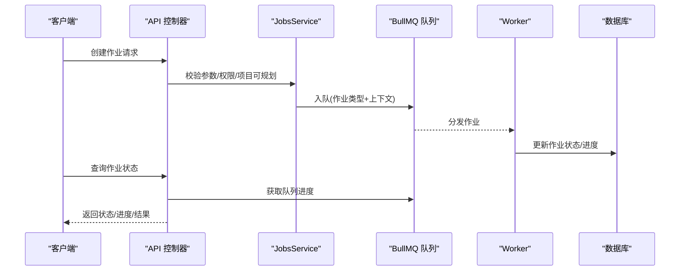
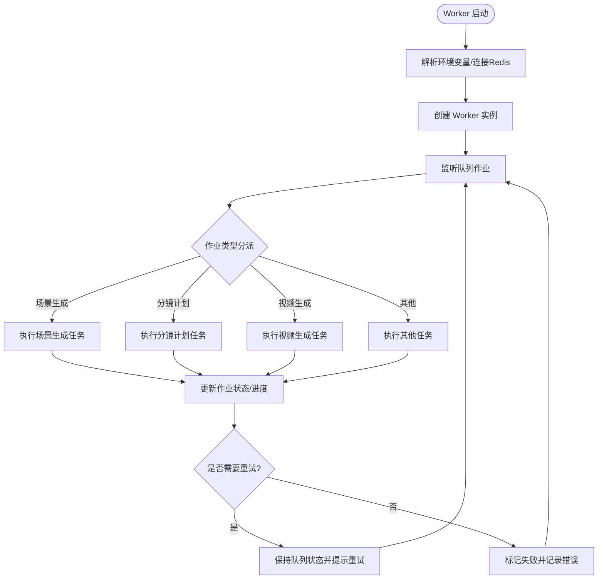
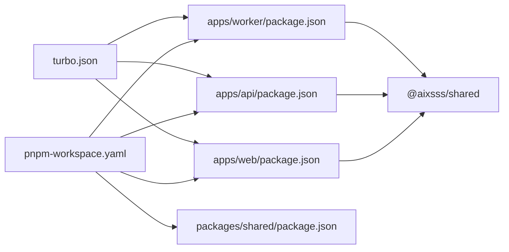

# 架构概览

<cite>
**本文引用的文件**
- [package.json](file://package.json)
- [pnpm-workspace.yaml](file://pnpm-workspace.yaml)
- [turbo.json](file://turbo.json)
- [apps/api/package.json](file://apps/api/package.json)
- [apps/api/src/main.ts](file://apps/api/src/main.ts)
- [apps/api/src/app.module.ts](file://apps/api/src/app.module.ts)
- [apps/api/src/jobs/jobs.module.ts](file://apps/api/src/jobs/jobs.module.ts)
- [apps/api/src/jobs/jobs.service.ts](file://apps/api/src/jobs/jobs.service.ts)
- [apps/web/package.json](file://apps/web/package.json)
- [apps/web/src/main.tsx](file://apps/web/src/main.tsx)
- [apps/web/src/App.tsx](file://apps/web/src/App.tsx)
- [apps/worker/package.json](file://apps/worker/package.json)
- [apps/worker/src/worker.ts](file://apps/worker/src/worker.ts)
- [docker-compose.dev.yml](file://docker-compose.dev.yml)
- [packages/shared/package.json](file://packages/shared/package.json)
- [packages/shared/src/index.ts](file://packages/shared/src/index.ts)
</cite>

## 目录

1. [引言](#引言)
2. [项目结构](#项目结构)
3. [核心组件](#核心组件)
4. [架构总览](#架构总览)
5. [详细组件分析](#详细组件分析)
6. [依赖分析](#依赖分析)
7. [性能考量](#性能考量)
8. [故障排查指南](#故障排查指南)
9. [结论](#结论)
10. [附录](#附录)

## 引言

本文件面向AIXSSS平台的架构概览与实施说明，目标是帮助开发者快速理解系统的整体设计、模块职责、交互关系与数据流。AIXSSS采用微服务化分层设计，包含三类核心模块：

- 前端Web应用：提供可视化编辑器、工作流编排与实时反馈。
- 后端API服务：统一对外接口、鉴权、业务编排与作业调度。
- Worker任务处理系统：基于队列的异步任务执行与结果持久化。

同时，项目采用monorepo组织方式，使用pnpm workspace与Turborepo进行多包管理与构建流水线治理，确保跨模块共享代码与一致的开发体验。

## 项目结构

AIXSSS以monorepo为核心组织形态，根目录通过脚本与配置统一驱动各子包的开发、构建与测试。关键结构与职责如下：

- apps/api：后端API服务，基于NestJS/Fastify，提供REST接口与作业队列编排。
- apps/web：前端单页应用，基于React/Vite，提供编辑器与工作流界面。
- apps/worker：异步任务执行器，基于BullMQ队列与Redis，承接API下发的任务。
- packages/shared：跨应用共享类型、模式与系统提示词，保证前后端一致性。
- 根级配置：pnpm workspace定义工作区范围；turbo管理任务依赖与缓存；docker-compose.dev提供本地开发依赖服务。

**图示来源**

- [package.json](file://package.json#L1-L24)
- [pnpm-workspace.yaml](file://pnpm-workspace.yaml#L1-L6)
- [turbo.json](file://turbo.json#L1-L30)
- [apps/web/package.json](file://apps/web/package.json#L1-L95)
- [apps/api/package.json](file://apps/api/package.json#L1-L52)
- [apps/worker/package.json](file://apps/worker/package.json#L1-L35)
- [docker-compose.dev.yml](file://docker-compose.dev.yml#L1-L35)

**章节来源**

- [package.json](file://package.json#L1-L24)
- [pnpm-workspace.yaml](file://pnpm-workspace.yaml#L1-L6)
- [turbo.json](file://turbo.json#L1-L30)

## 核心组件

- 前端Web应用（apps/web）
  - 路由与布局：基于React Router与自定义布局组件，支持项目列表、编辑器、系统提示词页等。
  - 数据与状态：使用React Query进行数据获取与缓存，Zustand管理应用状态（如主题、配置、项目等）。
  - 运行模式：根据运行模式切换本地模式与后端模式，实现离线/在线能力的动态切换。
  - 关键入口：根入口初始化查询客户端、路由与全局状态，渲染主应用组件。

- 后端API服务（apps/api）
  - 框架与适配：基于NestJS与Fastify适配器，启用CORS与全局异常过滤。
  - 模块化：按领域拆分模块（认证、项目、场景、角色、世界观、AI配置、作业等），统一在AppModule中装配。
  - 作业编排：通过JobsService对接BullMQ队列，封装多种AI作业的入队逻辑与进度读取。

- Worker任务处理系统（apps/worker）
  - 队列消费：Worker监听指定队列名称，按作业类型分派到具体任务处理器。
  - 状态管理：作业状态在数据库中持久化，支持运行中、成功、失败、取消等状态与重试策略。
  - 协作式取消：检测取消状态并提前终止后续步骤，避免覆盖产物或状态。

- 共享包（packages/shared）
  - 类型与模式：导出通用类型、Zod模式与系统提示词，供前端与后端复用。
  - 作用：降低重复定义成本，提升跨端一致性与可维护性。

**章节来源**

- [apps/web/src/main.tsx](file://apps/web/src/main.tsx#L1-L37)
- [apps/web/src/App.tsx](file://apps/web/src/App.tsx#L1-L392)
- [apps/api/src/main.ts](file://apps/api/src/main.ts#L1-L34)
- [apps/api/src/app.module.ts](file://apps/api/src/app.module.ts#L1-L37)
- [apps/api/src/jobs/jobs.module.ts](file://apps/api/src/jobs/jobs.module.ts#L1-L16)
- [apps/api/src/jobs/jobs.service.ts](file://apps/api/src/jobs/jobs.service.ts#L1-L800)
- [apps/worker/src/worker.ts](file://apps/worker/src/worker.ts#L1-L755)
- [packages/shared/src/index.ts](file://packages/shared/src/index.ts#L1-L6)

## 架构总览

AIXSSS采用“前端Web应用—后端API服务—Worker任务处理系统”的三层微服务架构，配合共享包与本地开发依赖服务，形成完整的端到端工作流。

**图示来源**

- [apps/web/src/App.tsx](file://apps/web/src/App.tsx#L1-L392)
- [apps/api/src/app.module.ts](file://apps/api/src/app.module.ts#L1-L37)
- [apps/api/src/jobs/jobs.service.ts](file://apps/api/src/jobs/jobs.service.ts#L1-L800)
- [apps/worker/src/worker.ts](file://apps/worker/src/worker.ts#L1-L755)
- [docker-compose.dev.yml](file://docker-compose.dev.yml#L1-L35)

## 详细组件分析

### 前端Web应用（apps/web）

- 路由与懒加载：使用React Router进行路径匹配，编辑器与重型组件采用懒加载与Suspense占位，优化首屏性能。
- 状态与数据流：React Query负责数据请求与缓存策略；Zustand管理主题、配置、项目与搜索等状态；全局Toast与键盘快捷键增强交互。
- 运行模式：根据运行模式决定是否连接后端API，支持本地离线编辑与后端在线模式的无缝切换。
- 事件与持久化：页面可见性变化与卸载事件触发补丁队列刷新，确保未提交变更不丢失。

**图示来源**

- [apps/web/src/main.tsx](file://apps/web/src/main.tsx#L1-L37)
- [apps/web/src/App.tsx](file://apps/web/src/App.tsx#L1-L392)

**章节来源**

- [apps/web/src/main.tsx](file://apps/web/src/main.tsx#L1-L37)
- [apps/web/src/App.tsx](file://apps/web/src/App.tsx#L1-L392)

### 后端API服务（apps/api）

- 启动与中间件：创建Nest应用实例，启用CORS与全局异常过滤，设置全局前缀与端口。
- 模块装配：ConfigModule校验环境变量，PrismaModule接入数据库，其他领域模块按需注入。
- 作业编排：JobsService封装作业入队、状态查询与进度读取，支持多种AI作业类型（如场景生成、分镜计划、视频生成等）。
- 控制器与服务：AIJobsController、WorkflowController、LlmController分别处理作业、工作流与LLM相关接口。

**图示来源**

- [apps/api/src/main.ts](file://apps/api/src/main.ts#L1-L34)
- [apps/api/src/app.module.ts](file://apps/api/src/app.module.ts#L1-L37)
- [apps/api/src/jobs/jobs.module.ts](file://apps/api/src/jobs/jobs.module.ts#L1-L16)
- [apps/api/src/jobs/jobs.service.ts](file://apps/api/src/jobs/jobs.service.ts#L1-L800)

**章节来源**

- [apps/api/src/main.ts](file://apps/api/src/main.ts#L1-L34)
- [apps/api/src/app.module.ts](file://apps/api/src/app.module.ts#L1-L37)
- [apps/api/src/jobs/jobs.module.ts](file://apps/api/src/jobs/jobs.module.ts#L1-L16)
- [apps/api/src/jobs/jobs.service.ts](file://apps/api/src/jobs/jobs.service.ts#L1-L800)

### Worker任务处理系统（apps/worker）

- 队列消费：Worker监听指定队列名，按作业类型分派到对应任务处理器（如场景生成、分镜计划、视频生成等）。
- 状态与进度：作业状态在数据库中持久化，支持运行中、成功、失败、取消；通过updateProgress上报进度。
- 重试与失败策略：根据作业尝试次数与最大重试限制决定是否保留队列状态或标记失败；协作式取消避免覆盖产物。
- 生命周期：优雅关闭时断开Redis与数据库连接，确保资源释放。

**图示来源**

- [apps/worker/src/worker.ts](file://apps/worker/src/worker.ts#L1-L755)

**章节来源**

- [apps/worker/src/worker.ts](file://apps/worker/src/worker.ts#L1-L755)

### 共享包（packages/shared）

- 统一契约：导出类型、Zod模式与系统提示词，确保前后端对数据结构与提示词的一致理解。
- 复用策略：前端与后端均以workspace:\*方式依赖，减少重复定义与版本漂移风险。

**章节来源**

- [packages/shared/src/index.ts](file://packages/shared/src/index.ts#L1-L6)

## 依赖分析

- 包管理与工作区
  - pnpm workspace：声明apps/*与packages/*为工作区，实现跨包依赖解析与统一安装。
  - Turborepo：通过turbo.json定义任务依赖（如build需依赖上游包）、输出缓存与并行执行策略。
  - 根脚本：dev/build/typecheck/lint/test/format等统一由根脚本委托给turbo执行，确保一致性。

- 应用间依赖
  - apps/web与apps/api：通过HTTP接口通信；前端通过API模块发起请求，后端提供REST接口与队列编排。
  - apps/api与apps/worker：通过Redis队列解耦，后端负责入队，Worker负责消费与结果回写。
  - 共享包：三端共享类型与模式，降低耦合度与维护成本。

**图示来源**

- [pnpm-workspace.yaml](file://pnpm-workspace.yaml#L1-L6)
- [turbo.json](file://turbo.json#L1-L30)
- [apps/web/package.json](file://apps/web/package.json#L1-L95)
- [apps/api/package.json](file://apps/api/package.json#L1-L52)
- [apps/worker/package.json](file://apps/worker/package.json#L1-L35)
- [packages/shared/package.json](file://packages/shared/package.json#L1-L32)

**章节来源**

- [pnpm-workspace.yaml](file://pnpm-workspace.yaml#L1-L6)
- [turbo.json](file://turbo.json#L1-L30)
- [apps/web/package.json](file://apps/web/package.json#L1-L95)
- [apps/api/package.json](file://apps/api/package.json#L1-L52)
- [apps/worker/package.json](file://apps/worker/package.json#L1-L35)
- [packages/shared/package.json](file://packages/shared/package.json#L1-L32)

## 性能考量

- 前端性能
  - 懒加载与Suspense：减少首屏体积，提升交互流畅度。
  - React Query缓存策略：合理设置staleTime与gcTime，降低重复请求与内存占用。
  - 状态分片：Zustand按域拆分store，避免全局订阅导致的重渲染。

- 后端性能
  - Fastify适配器：在NestJS中获得更佳的HTTP性能与更低的CPU开销。
  - 作业并发与重试：通过队列与重试策略平衡吞吐与稳定性，避免瞬时峰值压垮下游。

- Worker性能
  - 并发度与锁时长：通过环境变量控制并发与锁时长，兼顾吞吐与防抖动。
  - 协作式取消：及时响应取消指令，避免无效计算与资源浪费。

- 存储与I/O
  - 对象存储分离：视频与图片等大体积产物走独立存储，减轻数据库压力。
  - 数据库索引与查询：针对高频字段建立索引，减少慢查询。

[本节为通用指导，无需特定文件来源]

## 故障排查指南

- 常见问题定位
  - 队列无作业：检查API是否正确入队、Worker是否连接到同一Redis实例、队列名是否一致。
  - 作业卡住：查看作业状态与重试次数，确认是否存在无限重试或阻塞任务。
  - 前端无进度：确认API能从队列读取进度，前端是否正确订阅进度事件。
  - 数据不一致：核对协作式取消逻辑，避免在取消后继续写入最终产物。

- 日志与可观测性
  - Worker日志：关注作业ID、进度百分比与消息，定位耗时步骤。
  - API日志：关注入队参数、权限校验与项目可规划性校验。
  - 前端日志：通过调试工具观察请求与状态变化，确认路由与懒加载行为。

**章节来源**

- [apps/api/src/jobs/jobs.service.ts](file://apps/api/src/jobs/jobs.service.ts#L1-L800)
- [apps/worker/src/worker.ts](file://apps/worker/src/worker.ts#L1-L755)

## 结论

AIXSSS通过清晰的微服务分层与monorepo组织，实现了前端、后端与Worker的高效协同。共享包确保跨端一致性，Turborepo与pnpm workspace保障了工程化效率。结合队列化的异步处理与合理的缓存与重试策略，系统具备良好的扩展性与可维护性。建议在后续迭代中持续完善监控与告警体系，进一步提升生产环境的可观测性与稳定性。

[本节为总结性内容，无需特定文件来源]

## 附录

- 本地开发依赖服务
  - PostgreSQL、Redis与MinIO通过docker-compose.dev.yml一键启动，便于本地联调与测试。
  - 建议在开发机上先启动依赖服务，再启动各应用，确保连接稳定。

**章节来源**

- [docker-compose.dev.yml](file://docker-compose.dev.yml#L1-L35)
