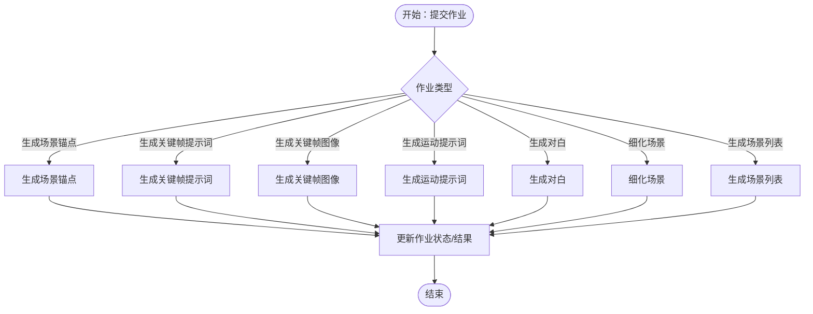

# 核心功能特性

<cite>
**本文引用的文件**
- [README.md](file://README.md)
- [apps/web/README.md](file://apps/web/README.md)
- [apps/web/FEATURES.md](file://apps/web/FEATURES.md)
- [apps/web/IMPLEMENTATION_SUMMARY.md](file://apps/web/IMPLEMENTATION_SUMMARY.md)
- [apps/web/FINAL_REPORT.md](file://apps/web/FINAL_REPORT.md)
- [apps/api/src/app.module.ts](file://apps/api/src/app.module.ts)
- [apps/api/src/main.ts](file://apps/api/src/main.ts)
- [apps/api/prisma/schema.prisma](file://apps/api/prisma/schema.prisma)
- [apps/api/src/ai-profiles/ai-profiles.controller.ts](file://apps/api/src/ai-profiles/ai-profiles.controller.ts)
- [apps/api/src/characters/characters.controller.ts](file://apps/api/src/characters/characters.controller.ts)
- [apps/api/src/world-view/world-view.controller.ts](file://apps/api/src/world-view/world-view.controller.ts)
- [apps/api/src/episodes/episodes.controller.ts](file://apps/api/src/episodes/episodes.controller.ts)
- [apps/worker/src/worker.ts](file://apps/worker/src/worker.ts)
- [packages/shared/src/index.ts](file://packages/shared/src/index.ts)
</cite>

## 目录

1. [简介](#简介)
2. [项目结构](#项目结构)
3. [核心组件](#核心组件)
4. [架构总览](#架构总览)
5. [详细组件分析](#详细组件分析)
6. [依赖分析](#依赖分析)
7. [性能考虑](#性能考虑)
8. [故障排查指南](#故障排查指南)
9. [结论](#结论)
10. [附录](#附录)

## 简介

AIXSSS（漫剧创作助手）是一个面向 AIGC 漫剧/短剧创作者的智能创作引导系统。平台通过前端分镜编辑与导出、后端鉴权与项目/分镜存储、Worker 队列化执行 AI 任务的三层架构，提供从“基础设定”到“分镜细化”再到“提示词导出”的完整工作流。平台支持多模态内容生成（文本、图像、视频）的提示词工程与分镜生成管线，并提供角色系统、世界观构建、分镜编辑与场景生成、AI 配置档案管理、协作式项目管理等能力。

平台特性涵盖：

- 智能叙事创作工作流：从项目基础设定到分镜生成与细化，支持因果链版本管理与工作流状态推进。
- 多模态内容生成：文本提示词生成、关键帧提示词、运动提示词、分镜场景圣经、分镜计划与视频生成。
- 角色系统与世界观构建：角色档案、关系图谱、出场统计与多维度世界观要素管理。
- 分镜编辑与场景生成：拖拽排序、批量操作、版本历史、对比合并、参数调优与统计面板。
- AI 配置档案管理：多供应商适配、参数调优、连接测试、加密存储与快速切换。
- 协作式项目管理：团队角色、项目工作流状态、作业队列与审计日志。

## 项目结构

平台采用 monorepo 结构，分为三端与共享包：

- apps/web：React + Vite 前端，提供编辑器、状态管理、AI 适配层与 UI 组件。
- apps/api：NestJS API，负责鉴权、项目/分镜/角色/世界观/作业队列等业务模块。
- apps/worker：BullMQ Worker，执行各类 AI 任务（分镜生成、细化、视频生成等）。
- packages/shared：前后端共享类型与 Zod Schema，统一数据契约。

图表来源

- [apps/api/src/app.module.ts](file://apps/api/src/app.module.ts#L16-L32)
- [apps/api/src/main.ts](file://apps/api/src/main.ts#L9-L25)
- [apps/worker/src/worker.ts](file://apps/worker/src/worker.ts#L44-L729)
- [packages/shared/src/index.ts](file://packages/shared/src/index.ts#L1-L3)

章节来源

- [README.md](file://README.md#L63-L73)
- [apps/web/README.md](file://apps/web/README.md#L101-L135)

## 核心组件

- 智能叙事创作工作流：项目工作流状态机驱动从“数据收集”到“导出”的全流程，支持因果链版本管理与阶段性校验。
- 多模态内容生成：从场景锚点到关键帧、运动提示词，再到分镜场景圣经与视频生成的完整管线。
- 角色系统：角色档案、关系图谱、出场统计与主题色配置。
- 世界观构建：多维度要素（时代/地理/社会/科技/魔法/自定义）管理与 AI 辅助生成。
- 分镜编辑与场景生成：拖拽排序、批量操作、版本历史、对比合并、参数调优与统计面板。
- AI 配置档案管理：多供应商适配、参数调优、连接测试、加密存储与快速切换。
- 协作式项目管理：团队角色、项目工作流状态、作业队列与审计日志。

章节来源

- [apps/web/FEATURES.md](file://apps/web/FEATURES.md#L191-L270)
- [apps/api/prisma/schema.prisma](file://apps/api/prisma/schema.prisma#L16-L32)
- [apps/api/src/characters/characters.controller.ts](file://apps/api/src/characters/characters.controller.ts#L10-L43)
- [apps/api/src/world-view/world-view.controller.ts](file://apps/api/src/world-view/world-view.controller.ts#L14-L54)
- [apps/api/src/episodes/episodes.controller.ts](file://apps/api/src/episodes/episodes.controller.ts#L9-L52)

## 架构总览

平台采用“前端编辑器 + 后端 API + Worker 队列”的分层架构。前端通过 REST API 与后端交互，后端通过 Prisma 访问 PostgreSQL，Worker 从 Redis 队列消费任务并执行 AI 生成与细化流程。共享包统一前后端数据契约。

图表来源

- [apps/api/src/main.ts](file://apps/api/src/main.ts#L9-L25)
- [apps/worker/src/worker.ts](file://apps/worker/src/worker.ts#L44-L729)
- [apps/api/prisma/schema.prisma](file://apps/api/prisma/schema.prisma#L311-L335)

章节来源

- [README.md](file://README.md#L3-L31)
- [apps/api/src/app.module.ts](file://apps/api/src/app.module.ts#L16-L32)

## 详细组件分析

### 智能叙事创作工作流

- 项目工作流状态机：从“数据收集”到“导出”，贯穿“世界构建”“角色管理”“剧集规划”“分镜生成/编辑/确认”“场景处理/完成”等阶段。
- 因果链版本管理：支持 AI/手动/恢复来源的版本快照，记录完成阶段与自洽校验状态，便于回溯与对比。
- 作业队列：按阶段触发 AI 生成与细化任务，支持取消、重试与进度上报。

图表来源

- [apps/api/prisma/schema.prisma](file://apps/api/prisma/schema.prisma#L16-L32)
- [apps/api/prisma/schema.prisma](file://apps/api/prisma/schema.prisma#L143-L174)

章节来源

- [apps/web/FEATURES.md](file://apps/web/FEATURES.md#L191-L270)
- [apps/web/IMPLEMENTATION_SUMMARY.md](file://apps/web/IMPLEMENTATION_SUMMARY.md#L11-L86)

### 多模态内容生成（文本、图像、视频）

- 文本提示词生成：场景锚点、关键帧提示词、运动提示词、分镜场景圣经、分镜计划与面板翻译。
- 图像/视频生成：关键帧图像生成、场景视频生成（预留接口）。
- 作业类型覆盖：生成场景列表、生成场景锚点、生成关键帧提示词、生成关键帧图像、生成运动提示词、生成对白、细化场景、批量细化等。

图表来源

- [apps/worker/src/worker.ts](file://apps/worker/src/worker.ts#L92-L673)

章节来源

- [apps/web/FEATURES.md](file://apps/web/FEATURES.md#L295-L344)
- [apps/worker/src/worker.ts](file://apps/worker/src/worker.ts#L145-L673)

### 角色系统与世界观构建

- 角色系统：角色档案（外貌/性格/背景）、关系图谱、出场统计、主题色配置；支持创建、更新、删除与批量操作。
- 世界观构建：多维度要素（时代/地理/社会/科技/魔法/自定义）管理，支持拖拽排序与 AI 辅助生成；可与分镜关联以确保一致性。

图表来源

- [apps/api/prisma/schema.prisma](file://apps/api/prisma/schema.prisma#L235-L257)
- [apps/api/prisma/schema.prisma](file://apps/api/prisma/schema.prisma#L259-L273)
- [apps/api/src/characters/characters.controller.ts](file://apps/api/src/characters/characters.controller.ts#L10-L43)
- [apps/api/src/world-view/world-view.controller.ts](file://apps/api/src/world-view/world-view.controller.ts#L14-L54)

章节来源

- [apps/web/FEATURES.md](file://apps/web/FEATURES.md#L212-L238)
- [apps/web/FEATURES.md](file://apps/web/FEATURES.md#L193-L210)
- [apps/api/src/characters/characters.controller.ts](file://apps/api/src/characters/characters.controller.ts#L10-L43)
- [apps/api/src/world-view/world-view.controller.ts](file://apps/api/src/world-view/world-view.controller.ts#L14-L54)

### 分镜编辑与场景生成

- 拖拽排序：基于 dnd-kit 的可视化拖拽，支持预览、确认/取消与键盘无障碍。
- 批量操作：批量生成、编辑、导出、删除与进度控制。
- 版本历史与对比合并：自动版本快照、时间线浏览、差异高亮与一键恢复。
- 参数调优：Temperature/TopP/MaxTokens/惩罚等参数预设与实时效果预览。
- 统计面板：项目统计、完成度分析、趋势图表与性能指标。

图表来源

- [apps/web/FEATURES.md](file://apps/web/FEATURES.md#L106-L124)
- [apps/web/FEATURES.md](file://apps/web/FEATURES.md#L262-L272)
- [apps/web/FEATURES.md](file://apps/web/FEATURES.md#L405-L414)
- [apps/web/FEATURES.md](file://apps/web/FEATURES.md#L416-L432)
- [apps/web/FEATURES.md](file://apps/web/FEATURES.md#L434-L459)

章节来源

- [apps/web/IMPLEMENTATION_SUMMARY.md](file://apps/web/IMPLEMENTATION_SUMMARY.md#L42-L50)
- [apps/web/IMPLEMENTATION_SUMMARY.md](file://apps/web/IMPLEMENTATION_SUMMARY.md#L127-L136)
- [apps/web/IMPLEMENTATION_SUMMARY.md](file://apps/web/IMPLEMENTATION_SUMMARY.md#L116-L126)
- [apps/web/IMPLEMENTATION_SUMMARY.md](file://apps/web/IMPLEMENTATION_SUMMARY.md#L201-L209)

### AI 配置档案管理

- 多供应商适配：DeepSeek/Kimi/Gemini/OpenAI 兼容/自定义 BaseURL。
- 参数调优：温度、TopP、最大 Token、惩罚项等核心参数与预设模式。
- 连接测试与加密存储：快速验证连接、API Key 加密存储与快速切换。

图表来源

- [apps/api/prisma/schema.prisma](file://apps/api/prisma/schema.prisma#L275-L292)
- [apps/api/prisma/schema.prisma](file://apps/api/prisma/schema.prisma#L311-L335)
- [apps/api/src/ai-profiles/ai-profiles.controller.ts](file://apps/api/src/ai-profiles/ai-profiles.controller.ts#L9-L35)

章节来源

- [apps/web/FEATURES.md](file://apps/web/FEATURES.md#L416-L432)
- [apps/api/src/ai-profiles/ai-profiles.controller.ts](file://apps/api/src/ai-profiles/ai-profiles.controller.ts#L9-L35)

### 协作式项目管理

- 团队角色：所有者/管理员/成员，权限分级。
- 项目工作流：明确的状态推进与审计日志。
- 作业队列：统一的 AI 作业生命周期管理与重试策略。

图表来源

- [apps/api/prisma/schema.prisma](file://apps/api/prisma/schema.prisma#L75-L114)
- [apps/api/prisma/schema.prisma](file://apps/api/prisma/schema.prisma#L87-L100)
- [apps/api/prisma/schema.prisma](file://apps/api/prisma/schema.prisma#L116-L141)
- [apps/api/prisma/schema.prisma](file://apps/api/prisma/schema.prisma#L311-L335)

章节来源

- [apps/api/prisma/schema.prisma](file://apps/api/prisma/schema.prisma#L10-L14)
- [apps/api/prisma/schema.prisma](file://apps/api/prisma/schema.prisma#L294-L309)

## 依赖分析

- 前端依赖：React 18.3、TypeScript 5.6、Vite 5、Shadcn/UI、Tailwind CSS、@dnd-kit、recharts、pako、immer 等。
- 后端依赖：NestJS、Prisma、Fastify、Zod、BullMQ、Redis、PostgreSQL。
- 共享包：统一类型与 Schema，确保前后端一致的数据契约。

图表来源

- [packages/shared/src/index.ts](file://packages/shared/src/index.ts#L1-L3)
- [apps/api/src/app.module.ts](file://apps/api/src/app.module.ts#L16-L32)
- [apps/worker/src/worker.ts](file://apps/worker/src/worker.ts#L44-L729)

章节来源

- [apps/web/IMPLEMENTATION_SUMMARY.md](file://apps/web/IMPLEMENTATION_SUMMARY.md#L260-L284)
- [apps/web/README.md](file://apps/web/README.md#L73-L100)

## 性能考虑

- 上下文压缩：减少 Token 消耗，动态预算管理与三种压缩策略。
- 数据分片与压缩：突破 LocalStorage 5MB 限制，Gzip 压缩节省空间。
- 渲染优化：React.memo、虚拟滚动、防抖/节流、懒加载。
- AI 调用优化：上下文压缩、请求合并、错误重试、流式响应。
- Worker 并发与锁：可配置并发、锁时长与停滞检测，避免误判。

章节来源

- [apps/web/IMPLEMENTATION_SUMMARY.md](file://apps/web/IMPLEMENTATION_SUMMARY.md#L311-L327)
- [apps/web/FINAL_REPORT.md](file://apps/web/FINAL_REPORT.md#L525-L547)

## 故障排查指南

- API 启动与跨域：确认 CORS Origin 与端口配置，启用全局异常过滤。
- Worker 运行：检查 Redis URL 解析、队列名称与并发配置，关注失败重试与取消协作。
- 数据迁移：初始化存储管理器，校验与修复数据完整性，清理过期数据。
- 错误处理：统一 try-catch、错误边界、Toast 提示与离线检测。

章节来源

- [apps/api/src/main.ts](file://apps/api/src/main.ts#L9-L25)
- [apps/worker/src/worker.ts](file://apps/worker/src/worker.ts#L34-L42)
- [apps/worker/src/worker.ts](file://apps/worker/src/worker.ts#L674-L719)
- [apps/web/IMPLEMENTATION_SUMMARY.md](file://apps/web/IMPLEMENTATION_SUMMARY.md#L59-L67)

## 结论

AIXSSS 平台通过清晰的工作流状态机、完善的多模态生成管线、角色与世界观构建、分镜编辑与版本管理、AI 配置档案与协作式项目管理，形成了从“创意到产出”的闭环。平台在前端性能优化、上下文压缩、流式响应与 Worker 并发方面具备显著优势，能够满足专业创作者对效率与一致性的需求。

## 附录

### 功能对比表（与同类工具的差异化优势）

- 智能叙事创作工作流：提供从“基础设定”到“导出”的完整工作流与因果链版本管理，支持阶段化校验与回溯。
- 多模态内容生成：覆盖从场景锚点到关键帧、运动提示词、场景圣经与视频生成的完整管线。
- 角色系统与世界观构建：提供角色关系图谱、出场统计与多维度世界观要素管理，确保创作一致性。
- 分镜编辑与场景生成：拖拽排序、批量操作、版本历史、对比合并、参数调优与统计面板。
- AI 配置档案管理：多供应商适配、参数调优、连接测试、加密存储与快速切换。
- 协作式项目管理：团队角色、项目工作流状态、作业队列与审计日志。

章节来源

- [apps/web/FEATURES.md](file://apps/web/FEATURES.md#L191-L270)
- [apps/web/FINAL_REPORT.md](file://apps/web/FINAL_REPORT.md#L550-L569)
