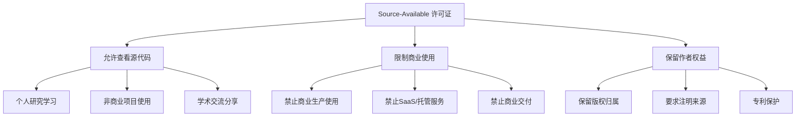
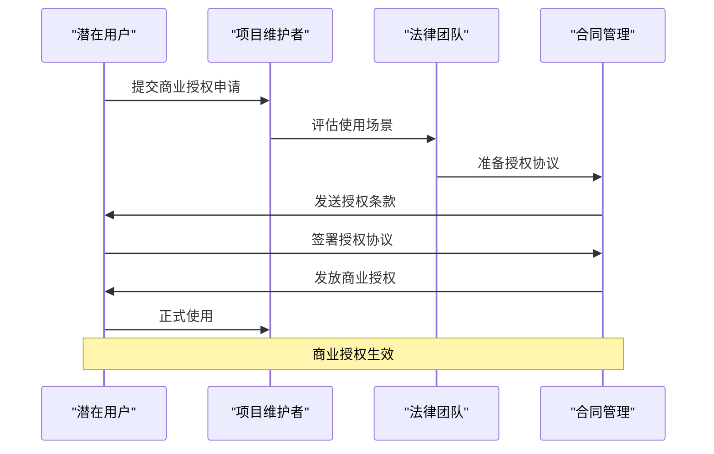

# 许可证与商业条款

<cite>
**本文档引用的文件**
- [LICENSE](file://LICENSE)
- [COMMERCIAL_LICENSE.md](file://COMMERCIAL_LICENSE.md)
- [README.md](file://README.md)
- [package.json](file://package.json)
- [apps/api/package.json](file://apps/api/package.json)
- [apps/web/package.json](file://apps/web/package.json)
- [packages/shared/package.json](file://packages/shared/package.json)
- [apps/web/README.md](file://apps/web/README.md)
- [apps/web/FEATURES.md](file://apps/web/FEATURES.md)
</cite>

## 目录

1. [简介](#简介)
2. [许可证概述](#许可证概述)
3. [PolyForm Noncommercial 1.0.0 许可证详解](#polyform-noncommercial-1-0-0-许可证详解)
4. [允许的使用场景](#允许的使用场景)
5. [禁止的使用场景](#禁止的使用场景)
6. [商业用途申请流程](#商业用途申请流程)
7. [开源社区影响与可持续发展](#开源社区影响与可持续发展)
8. [合规使用指南](#合规使用指南)
9. [常见问题解答](#常见问题解答)
10. [结论](#结论)

## 简介

AIXSSS（漫剧创作助手）是一个面向AIGC漫剧/短剧创作者的创作引导系统。该项目采用独特的source-available（可看源码）许可证模式，默认使用PolyForm Noncommercial 1.0.0许可证。这种许可证模式旨在平衡开源社区的开放性与商业可持续性的需求。

本项目的核心架构包括：

- **前端应用**：React + Vite构建的可视化编辑器
- **后端API**：NestJS框架提供鉴权、项目管理和AI工作流
- **Worker服务**：BullMQ队列执行AI任务
- **共享包**：前后端通用的数据模型和类型定义

## 许可证概述

### 许可证模式特点

AIXSSS采用的是**source-available（可看源码）**许可证模式，这一模式具有以下特点：

**图表来源**

- [LICENSE](file://LICENSE#L1-L132)
- [COMMERCIAL_LICENSE.md](file://COMMERCIAL_LICENSE.md#L1-L28)

### 默认许可证

项目默认采用**PolyForm Noncommercial 1.0.0**许可证，这是一个专门为非商业用途设计的现代开源许可证。该许可证由PolyForm项目提供，专门针对商业软件的非商业使用场景。

**章节来源**

- [LICENSE](file://LICENSE#L1-L132)
- [README.md](file://README.md#L84-L91)
- [apps/web/README.md](file://apps/web/README.md#L193-L200)

## PolyForm Noncommercial 1.0.0 许可证详解

### 许可证核心条款

PolyForm Noncommercial 1.0.0许可证包含以下核心条款：

#### 版权许可（Copyright License）

- 授予用户对软件的版权许可
- 仅限于允许的目的使用
- 分发需遵循分发许可
- 修改和新作品需遵循变更许可

#### 分发许可（Distribution License）

- 授予分发软件的额外版权许可
- 允许分发包含变更和新作品的软件
- 必须符合变更和新作品许可

#### 专利许可（Patent License）

- 授予使用软件的专利许可
- 覆盖专利侵权索赔
- 仅限于被许可人有权许可的专利

#### 非商业目的（Noncommercial Purposes）

- 任何非商业目的均为允许目的
- 包括个人使用、研究、教育等

**章节来源**

- [LICENSE](file://LICENSE#L11-L51)

### 允许的使用范围

根据许可证条款，以下使用场景属于允许范围：

#### 个人使用

- **研究用途**：用于学术研究和个人探索
- **实验用途**：技术验证和原型开发
- **测试用途**：功能测试和性能评估
- **公共知识受益**：促进技术传播和知识共享

#### 学习用途

- **个人学习**：编程技能提升和技术学习
- **学术研究**：高校教学和科研项目
- **技术交流**：开发者社区分享和讨论

#### 非商业组织使用

- **慈善组织**：NGO和公益机构
- **教育机构**：学校、大学和培训机构
- **公共研究组织**：科研院所和实验室
- **政府机构**：政府部门和公共部门

**章节来源**

- [LICENSE](file://LICENSE#L52-L76)

### 禁止的使用范围

以下使用场景明确禁止：

#### 商业生产使用

- **企业内部使用**：公司生产环境部署
- **商业服务提供**：面向付费用户的商业服务
- **产品集成**：作为商业产品的组成部分

#### 对外提供SaaS/托管服务

- **在线服务**：通过互联网提供软件即服务
- **托管服务**：为第三方提供托管和运维
- **多租户服务**：支持多个独立用户的在线服务

#### 商业交付

- **软件销售**：直接销售软件产品
- **服务收费**：基于使用量的服务收费
- **商业授权**：向第三方转授商业使用权

**章节来源**

- [LICENSE](file://LICENSE#L52-L76)
- [COMMERCIAL_LICENSE.md](file://COMMERCIAL_LICENSE.md#L5-L12)

## 允许的使用场景

### 个人/研究/学习场景

#### 个人项目使用

- **个人学习**：开发者个人技术提升
- **兴趣项目**：业余爱好和兴趣开发
- **技术探索**：新技术验证和实验

#### 教育和学术场景

- **课程教学**：计算机科学和AI课程
- **学术研究**：人工智能和创作工具研究
- **论文开发**：毕业论文和学术项目

#### 开源社区贡献

- **社区项目**：开源生态系统的贡献
- **技术分享**：经验总结和知识分享
- **工具改进**：功能增强和bug修复

### 非商业自用场景

#### 实验室和研究机构

- **学术研究**：高校和科研院所
- **实验室项目**：基础研究和应用探索
- **技术验证**：概念验证和原型开发

#### 非营利组织

- **慈善项目**：公益性质的技术应用
- **文化项目**：艺术创作和文化传播
- **教育项目**：免费教育资源开发

**章节来源**

- [LICENSE](file://LICENSE#L56-L71)

## 禁止的使用场景

### 商业生产使用限制

#### 企业内部部署

- **生产环境**：公司正式业务系统
- **商业服务**：面向付费用户的在线服务
- **产品集成**：作为商业产品的组件

#### 直接商业用途

- **软件销售**：出售软件许可证或使用权
- **服务收费**：按使用量或功能收费
- **商业授权**：向第三方转授商业权利

### SaaS/托管服务限制

#### 在线服务提供

- **多租户平台**：支持多个独立用户的在线系统
- **托管服务**：为第三方提供基础设施托管
- **API服务**：通过API接口提供商业服务

#### 间接商业用途

- **商业交付**：向客户交付软件解决方案
- **商业咨询**：基于软件提供商业咨询服务
- **商业培训**：使用软件进行商业培训

**章节来源**

- [LICENSE](file://LICENSE#L52-L76)
- [COMMERCIAL_LICENSE.md](file://COMMERCIAL_LICENSE.md#L5-L12)

## 商业用途申请流程

### 申请条件

当需要在以下场景使用时，必须申请商业授权：

#### 生产环境使用

- 公司或组织的正式生产环境
- 内部或对外提供的商业服务
- 任何以商业优势为目的的使用

#### 服务提供场景

- 将项目作为产品/服务的一部分
- 提供托管/代运维/在线服务（SaaS/托管版）
- 向第三方交付软件或服务

### 申请流程

**图表来源**

- [COMMERCIAL_LICENSE.md](file://COMMERCIAL_LICENSE.md#L14-L27)

### 申请步骤

#### 第一步：需求评估

1. **使用场景确认**：明确具体的使用目的和范围
2. **规模评估**：确定用户数量、部署环境等
3. **预算准备**：准备相应的授权费用

#### 第二步：联系维护者

1. **邮件联系**：发送至指定邮箱
2. **GitHub沟通**：通过Issues/Discussions模板
3. **需求说明**：详细描述使用场景和要求

#### 第三步：协议签署

1. **条款协商**：讨论具体使用条件
2. **费用确认**：确定授权费用和支付方式
3. **协议签署**：正式签署商业授权协议

**章节来源**

- [COMMERCIAL_LICENSE.md](file://COMMERCIAL_LICENSE.md#L14-L27)

### 商业授权内容

标准商业授权通常包含：

#### 核心授权内容

- **商业使用许可**：允许在生产环境使用
- **SaaS服务支持**：允许提供托管和在线服务
- **商业交付权限**：允许向第三方交付

#### 可选增值服务

- **优先技术支持**：享受更快的技术支持响应
- **定制开发服务**：根据需求进行功能定制
- **品牌使用授权**：在特定范围内使用项目标识

**章节来源**

- [COMMERCIAL_LICENSE.md](file://COMMERCIAL_LICENSE.md#L21-L27)

## 开源社区影响与可持续发展

### 对开源社区的影响

#### 积极影响

- **技术传播**：源代码开放促进技术交流
- **学习资源**：为开发者提供学习参考
- **创新激励**：鼓励技术创新和改进
- **生态建设**：推动相关技术生态发展

#### 局限性考虑

- **商业使用限制**：可能影响某些商业项目的采用
- **社区贡献**：限制了商业驱动的贡献
- **技术扩散**：可能延缓技术在商业领域的应用

### 项目可持续发展

#### 经济可持续性

- **商业授权收入**：通过商业授权获得收益
- **服务支持**：提供付费技术支持和维护
- **定制开发**：满足特殊需求的定制服务

#### 技术可持续性

- **持续改进**：商业收入支持持续开发
- **质量保证**：确保代码质量和稳定性
- **社区维护**：平衡开源和商业需求

#### 社会责任

- **开源精神**：保持部分开源的社区贡献
- **教育价值**：为学习和研究提供资源
- **技术进步**：推动相关技术的发展

**章节来源**

- [COMMERCIAL_LICENSE.md](file://COMMERCIAL_LICENSE.md#L21-L27)

## 合规使用指南

### 个人用户合规要点

#### 使用范围确认

1. **明确使用目的**：确保仅用于个人/研究/学习
2. **避免商业用途**：不得用于任何商业活动
3. **遵守许可证条款**：严格遵循许可证所有要求

#### 注意事项

- **版权声明**：保留原始版权声明
- **许可证传递**：向使用者提供许可证信息
- **修改标注**：如有修改需明确标注

### 教育机构合规要点

#### 教学使用

- **课程材料**：作为教学参考资料
- **学生项目**：支持学生学习和实验
- **学术研究**：用于研究和学术交流

#### 禁止事项

- **商业课程**：不得用于收费课程
- **商业化运营**：不得通过此项目获利
- **商业交付**：不得向第三方收取费用

### 企业合规要点

#### 合规使用

- **内部学习**：仅供员工学习和研究
- **概念验证**：用于技术验证和评估
- **非商业项目**：仅限非商业性质项目

#### 风险规避

- **避免生产使用**：不得部署到生产环境
- **防止商业化**：不得用于商业服务
- **保护知识产权**：尊重原作者权益

**章节来源**

- [LICENSE](file://LICENSE#L30-L44)
- [README.md](file://README.md#L84-L91)

### 最佳实践建议

#### 开源贡献

- **积极反馈**：及时报告问题和建议
- **代码贡献**：在允许范围内贡献代码
- **文档完善**：帮助完善项目文档

#### 使用记录

- **使用登记**：记录使用目的和范围
- **合规检查**：定期检查使用是否合规
- **风险评估**：评估潜在的合规风险

#### 法律咨询

- **专业咨询**：复杂情况下寻求法律意见
- **合同审查**：重要使用场景审查合同
- **风险控制**：建立合规风险控制机制

## 常见问题解答

### 我可以在我的个人博客中展示这个项目吗？

**可以**，但仅限于个人学习和研究目的。如果您的博客是商业性质的（如广告收入、付费订阅等），则需要申请商业授权。

### 我可以用这个项目做个人作品集展示吗？

**可以**，前提是仅用于个人作品展示，不得用于商业目的。如果作品集涉及商业展示或销售，则需要商业授权。

### 我能用这个项目做教育培训吗？

**可以**，用于非商业的教育培训活动。但如果涉及收费培训、商业课程或营利性教育机构，则需要商业授权。

### 我能在我的公司内部使用这个项目吗？

**可以**，仅限于内部学习和研究目的。如果用于公司的正式业务系统或对外提供服务，则需要商业授权。

### 我能基于这个项目开发商业软件吗？

**不能**，除非获得商业授权。即使只是学习目的也不得用于商业开发。

### 我需要申请商业授权吗？

需要申请的情况包括：

- 公司或组织在生产环境使用
- 对外提供SaaS/托管服务
- 向第三方交付软件或服务
- 任何以商业优势为目的的使用

**章节来源**

- [COMMERCIAL_LICENSE.md](file://COMMERCIAL_LICENSE.md#L5-L12)

## 结论

AIXSSS项目的source-available许可证模式代表了一种平衡开源开放性和商业可持续性的创新尝试。通过PolyForm Noncommercial 1.0.0许可证，项目在保持开源社区活力的同时，也为商业可持续发展提供了可行路径。

### 关键要点总结

#### 许可证特点

- **开放透明**：源代码完全开放，便于学习和研究
- **商业限制**：有效保护作者的商业利益
- **灵活适用**：涵盖个人、研究、学习等多种场景

#### 合规使用原则

- **明确边界**：严格区分允许和禁止的使用场景
- **诚实守约**：遵守许可证的所有条款要求
- **及时申请**：需要商业用途时及时申请授权

#### 未来发展展望

- **生态建设**：继续完善开源社区生态
- **商业合作**：探索更多商业合作机会
- **技术创新**：在合规前提下持续推进技术发展

通过合理使用和遵守许可证条款，AIXSSS项目能够在开源社区和商业应用之间找到最佳平衡点，实现技术的可持续发展和社会价值的最大化。
