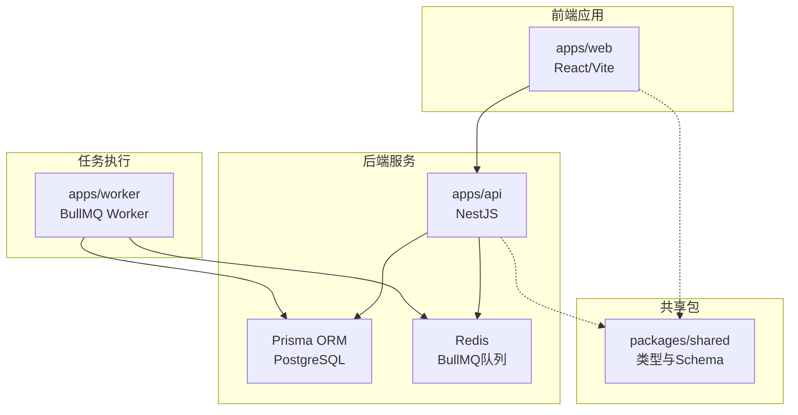
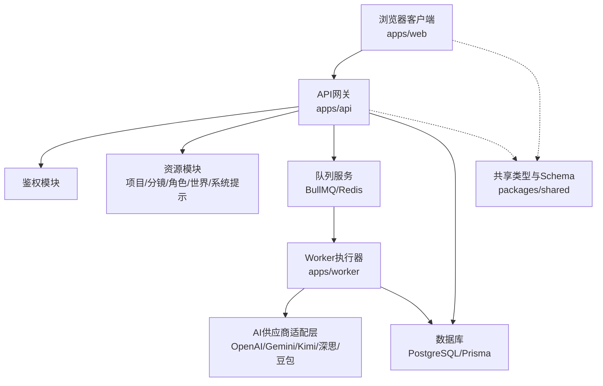
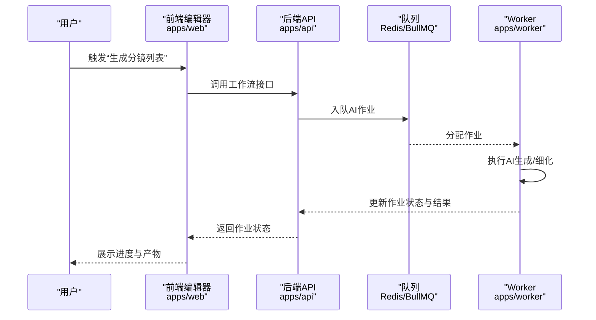
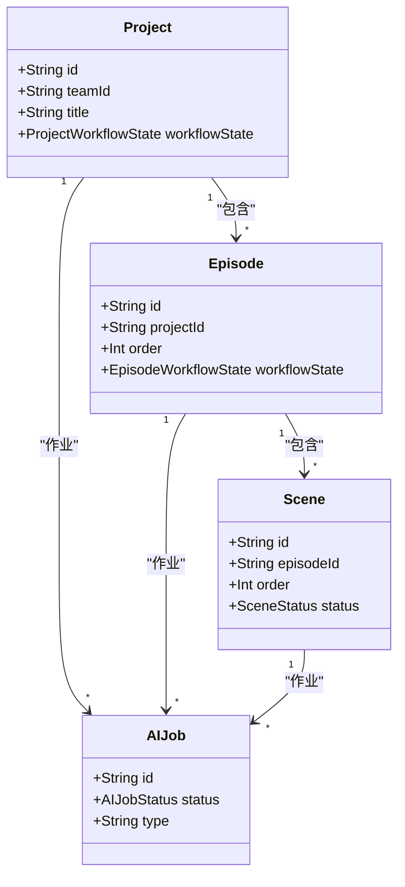
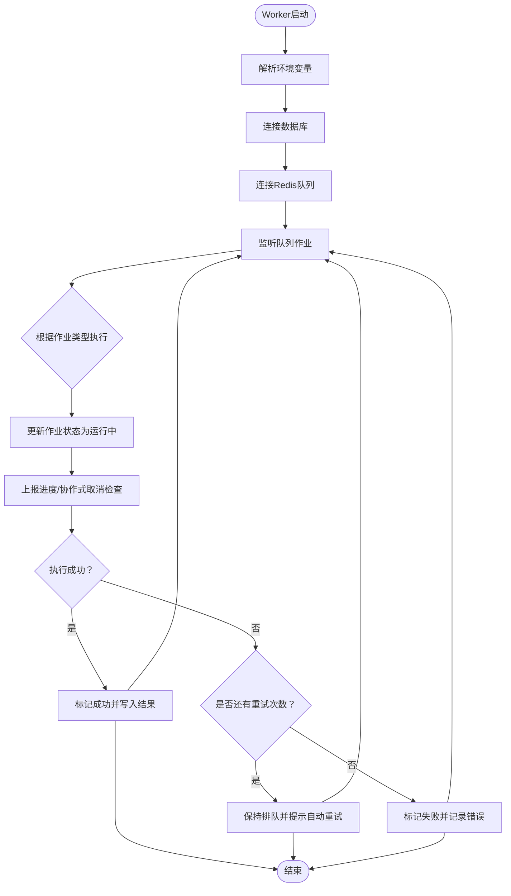
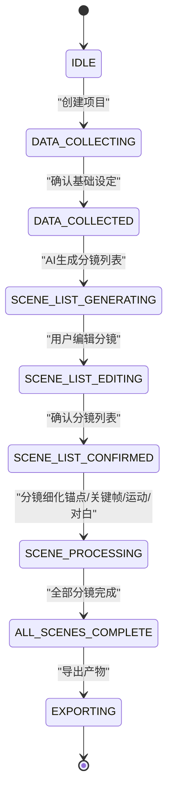
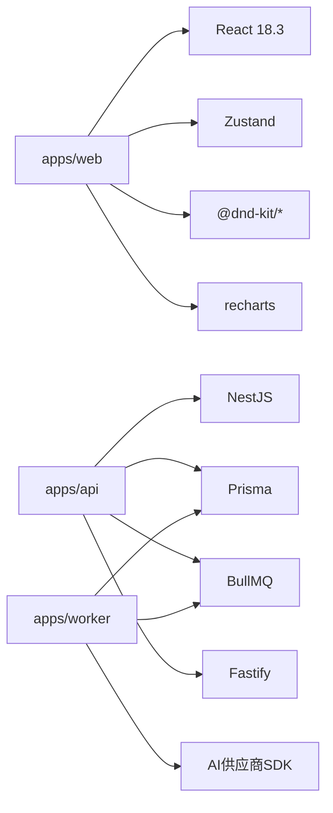

# 项目介绍与愿景

<cite>
**本文档引用的文件**
- [README.md](file://README.md)
- [apps/web/README.md](file://apps/web/README.md)
- [apps/api/src/main.ts](file://apps/api/src/main.ts)
- [apps/worker/src/worker.ts](file://apps/worker/src/worker.ts)
- [apps/api/src/app.module.ts](file://apps/api/src/app.module.ts)
- [apps/web/src/App.tsx](file://apps/web/src/App.tsx)
- [apps/api/ENVIRONMENT.md](file://apps/api/ENVIRONMENT.md)
- [apps/worker/ENVIRONMENT.md](file://apps/worker/ENVIRONMENT.md)
- [apps/api/src/jobs/jobs.service.ts](file://apps/api/src/jobs/jobs.service.ts)
- [apps/api/prisma/schema.prisma](file://apps/api/prisma/schema.prisma)
- [apps/web/FINAL_REPORT.md](file://apps/web/FINAL_REPORT.md)
- [apps/web/IMPLEMENTATION_SUMMARY.md](file://apps/web/IMPLEMENTATION_SUMMARY.md)
- [apps/web/src/components/editor/SceneGeneration.tsx](file://apps/web/src/components/editor/SceneGeneration.tsx)
- [apps/web/src/stores/episodeStore.ts](file://apps/web/src/stores/episodeStore.ts)
- [apps/web/src/lib/workflowV2/index.ts](file://apps/web/src/lib/workflowV2/index.ts)
- [prd_backup.md](file://prd_backup.md)
</cite>

## 目录

1. [引言](#引言)
2. [项目结构](#项目结构)
3. [核心组件](#核心组件)
4. [架构总览](#架构总览)
5. [详细组件分析](#详细组件分析)
6. [依赖分析](#依赖分析)
7. [性能考虑](#性能考虑)
8. [故障排除指南](#故障排除指南)
9. [结论](#结论)
10. [附录](#附录)

## 引言

AIXSSS（漫剧创作助手）是一个面向AIGC漫剧/短剧创作者的智能化创作引导系统。平台通过“前端分镜编辑与导出 + 后端鉴权与队列化AI工作流 + Worker执行AI任务”的三层架构，为创作者提供从基础设定到分镜细化再到多模态内容导出的完整创作闭环。平台的核心使命是降低AIGC内容创作门槛，提升创作效率与一致性，支持从个人创作者到团队协作的多样化场景。

平台的愿景是成为“可看源码、可扩展、可协作”的下一代叙事创作基础设施，持续推动AIGC在漫剧/短剧领域的规模化应用与标准化实践。

## 项目结构

项目采用monorepo结构，分为三个主要应用与共享包：

- apps/web：React + Vite前端应用，提供分镜编辑、工作流管理、导出与设置等功能
- apps/api：NestJS后端服务，负责鉴权、项目/分镜存储、AI作业队列与工作流编排
- apps/worker：基于BullMQ的任务执行器，承接后端队列中的AI任务并落地执行
- packages/shared：前后端共享的类型与Zod Schema，保障数据契约一致性

**图表来源**

- [apps/api/src/main.ts](file://apps/api/src/main.ts#L9-L26)
- [apps/worker/src/worker.ts](file://apps/worker/src/worker.ts#L44-L729)
- [apps/api/prisma/schema.prisma](file://apps/api/prisma/schema.prisma#L1-L8)

**章节来源**

- [README.md](file://README.md#L63-L73)
- [apps/web/README.md](file://apps/web/README.md#L101-L135)

## 核心组件

- 前端编辑器（apps/web）
  - 提供项目管理、基础设定、分镜生成与细化、提示词导出、AI参数调优、版本管理、搜索与快捷键等能力
  - 支持本地模式与服务端模式，前者将API Key加密存储于浏览器，后者将API Key托管于后端
- 后端API（apps/api）
  - 基于NestJS，提供鉴权、项目/分镜/角色/世界观/系统提示词等资源管理
  - 通过Prisma连接PostgreSQL，使用BullMQ队列承载AI作业生命周期管理
- Worker（apps/worker）
  - 基于BullMQ Worker消费队列任务，执行各类AI生成与细化流程（场景锚点、关键帧、运动提示、对白、视频等）
  - 支持进度上报、协作式取消、自动重试与状态持久化

**章节来源**

- [apps/web/README.md](file://apps/web/README.md#L11-L72)
- [apps/api/src/app.module.ts](file://apps/api/src/app.module.ts#L16-L34)
- [apps/api/src/jobs/jobs.service.ts](file://apps/api/src/jobs/jobs.service.ts#L37-L43)
- [apps/worker/src/worker.ts](file://apps/worker/src/worker.ts#L44-L729)

## 架构总览

平台采用“前端-后端-任务执行”的分层架构，结合队列化工作流实现创作过程的自动化与可观测性。

**图表来源**

- [apps/api/src/main.ts](file://apps/api/src/main.ts#L9-L26)
- [apps/worker/src/worker.ts](file://apps/worker/src/worker.ts#L44-L729)
- [apps/api/prisma/schema.prisma](file://apps/api/prisma/schema.prisma#L1-L8)

## 详细组件分析

### 前端编辑器（apps/web）

- 分镜生成与细化工作流
  - 通过工作流API触发后端队列任务，前端轮询进度并更新UI状态
  - 支持批量操作、版本历史、对比合并、模板系统、键盘快捷键等增强体验
- 数据与状态管理
  - 使用Zustand进行轻量级状态管理，结合LocalStorage持久化与版本迁移
  - 支持本地模式与服务端模式，API Key加密存储，避免浏览器直连供应商
- UI/UX与可访问性
  - 基于Shadcn/UI与Tailwind CSS，提供渐进式披露、响应式布局与暗色主题

**图表来源**

- [apps/web/src/components/editor/SceneGeneration.tsx](file://apps/web/src/components/editor/SceneGeneration.tsx#L128-L173)
- [apps/api/src/jobs/jobs.service.ts](file://apps/api/src/jobs/jobs.service.ts#L378-L418)
- [apps/worker/src/worker.ts](file://apps/worker/src/worker.ts#L145-L169)

**章节来源**

- [apps/web/README.md](file://apps/web/README.md#L11-L72)
- [apps/web/FINAL_REPORT.md](file://apps/web/FINAL_REPORT.md#L58-L200)
- [apps/web/IMPLEMENTATION_SUMMARY.md](file://apps/web/IMPLEMENTATION_SUMMARY.md#L11-L86)

### 后端API（apps/api）

- 鉴权与资源管理
  - JWT鉴权、用户/团队/成员模型、项目/分镜/角色/世界/系统提示词等资源CRUD
  - 严格的权限校验与资源存在性检查，防止越权与非法请求
- 队列化工作流
  - 通过BullMQ队列承载AI作业生命周期：入队、执行、重试、完成/失败/取消
  - 作业状态与进度持久化，前端可轮询查询
- 数据模型与状态机
  - 项目/剧集/分镜状态枚举，清晰表达创作流程的阶段推进与回退

**图表来源**

- [apps/api/prisma/schema.prisma](file://apps/api/prisma/schema.prisma#L116-L233)

**章节来源**

- [apps/api/src/app.module.ts](file://apps/api/src/app.module.ts#L16-L34)
- [apps/api/src/jobs/jobs.service.ts](file://apps/api/src/jobs/jobs.service.ts#L37-L100)
- [apps/api/prisma/schema.prisma](file://apps/api/prisma/schema.prisma#L16-L51)

### Worker（apps/worker）

- 任务执行与状态管理
  - 基于作业类型分发到具体任务处理器（场景锚点、关键帧、运动提示、对白、视频等）
  - 协作式取消：检测取消状态后抛错中止后续步骤，避免覆盖产物
  - 自动重试与进度提示，失败时保留作业状态以便前端感知
- 安全与可运维
  - 通过环境变量配置Redis连接、队列名与并发度
  - 优雅关闭与信号处理，保障任务执行的稳定性

**图表来源**

- [apps/worker/src/worker.ts](file://apps/worker/src/worker.ts#L44-L729)

**章节来源**

- [apps/worker/src/worker.ts](file://apps/worker/src/worker.ts#L44-L729)
- [apps/worker/ENVIRONMENT.md](file://apps/worker/ENVIRONMENT.md#L1-L25)

### 创作流程与工作流状态机

平台围绕“项目-剧集-分镜”的创作流程，定义了清晰的工作流状态机，覆盖从基础设定到导出的完整路径。

**图表来源**

- [apps/api/prisma/schema.prisma](file://apps/api/prisma/schema.prisma#L16-L32)
- [prd_backup.md](file://prd_backup.md#L1054-L1100)

**章节来源**

- [apps/api/prisma/schema.prisma](file://apps/api/prisma/schema.prisma#L16-L32)
- [prd_backup.md](file://prd_backup.md#L1054-L1100)

## 依赖分析

- 前端依赖
  - React 18.3、TypeScript 5.6、Vite 5、Shadcn/UI、Tailwind CSS、Zustand、@dnd-kit、recharts等
  - 通过懒加载与虚拟滚动优化渲染性能，分块存储与压缩优化本地存储
- 后端依赖
  - NestJS、Prisma、BullMQ、Fastify、JWT、CORS、Zod校验等
  - 通过模块化结构（Auth/Projects/Scenes/Characters/WorldView/AIProfiles/Jobs/SystemPrompts）实现高内聚低耦合
- Worker依赖
  - BullMQ、Prisma、Redis、AI供应商SDK（OpenAI/Gemini/Kimi/深思/豆包）

**图表来源**

- [apps/web/README.md](file://apps/web/README.md#L73-L100)
- [apps/api/src/app.module.ts](file://apps/api/src/app.module.ts#L16-L34)
- [apps/worker/src/worker.ts](file://apps/worker/src/worker.ts#L1-L30)

**章节来源**

- [apps/web/README.md](file://apps/web/README.md#L73-L100)
- [apps/web/FINAL_REPORT.md](file://apps/web/FINAL_REPORT.md#L466-L498)
- [apps/worker/ENVIRONMENT.md](file://apps/worker/ENVIRONMENT.md#L1-L25)

## 性能考虑

- 前端性能
  - 分块存储与Gzip压缩，突破LocalStorage容量限制并降低占用
  - React.memo、虚拟滚动、防抖节流与懒加载，显著提升大项目渲染性能
  - 上下文压缩与流式响应处理，降低AI调用成本与延迟
- 后端性能
  - BullMQ队列化异步执行，避免阻塞请求；Prisma连接池与索引优化
  - 作业状态持久化与进度上报，前端可快速感知执行状态
- Worker性能
  - 并发度可控、锁时长与stalled检测，避免误判与资源浪费
  - 协作式取消与自动重试，兼顾可靠性与用户体验

**章节来源**

- [apps/web/FINAL_REPORT.md](file://apps/web/FINAL_REPORT.md#L525-L547)
- [apps/web/IMPLEMENTATION_SUMMARY.md](file://apps/web/IMPLEMENTATION_SUMMARY.md#L311-L327)
- [apps/worker/src/worker.ts](file://apps/worker/src/worker.ts#L721-L729)

## 故障排除指南

- 环境变量配置
  - API与Worker需分别配置数据库URL、Redis连接、队列名与API Key加密密钥
  - CORS与端口需与前端开发服务器匹配
- 队列与作业
  - 如出现“自动重试”提示，前端会保持等待；可在Worker日志中查看具体错误堆栈
  - 作业被取消时，Worker会协作式中止并避免覆盖产物
- 数据库迁移
  - 首次启动或迁移变更后，需执行数据库迁移命令；生产环境使用部署命令
- 前端模式切换
  - 本地模式将API Key加密存储于浏览器；服务端模式由后端托管API Key，前端不直接调用供应商接口

**章节来源**

- [apps/api/ENVIRONMENT.md](file://apps/api/ENVIRONMENT.md#L1-L31)
- [apps/worker/ENVIRONMENT.md](file://apps/worker/ENVIRONMENT.md#L1-L25)
- [apps/worker/src/worker.ts](file://apps/worker/src/worker.ts#L674-L719)
- [README.md](file://README.md#L35-L47)

## 结论

AIXSSS以“前端引导创作 + 后端编排 + Worker执行”的架构，构建了面向AIGC漫剧/短剧创作者的完整创作引导系统。平台在功能完整性、易用性、效率与安全性方面实现了显著提升，既能满足个人创作者的入门需求，也能支撑团队协作与规模化生产。通过持续的模块化演进与工程化实践，AIXSSS正逐步成为AIGC叙事创作领域的重要基础设施。

## 附录

- 快速开始与开发指南
  - 安装依赖、构建共享包、启动依赖服务、配置环境变量、数据库迁移、启动开发
- 本地数据迁移
  - API模式下可将浏览器本地项目导入云端，保留核心数据并支持后续扩展
- 许可证
  - 默认采用PolyForm Noncommercial 1.0.0，商业用途需另行授权

**章节来源**

- [README.md](file://README.md#L5-L61)
- [README.md](file://README.md#L75-L82)
- [README.md](file://README.md#L84-L92)
