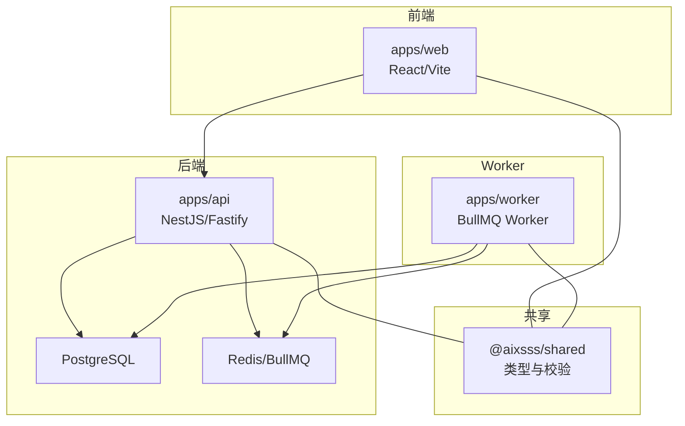
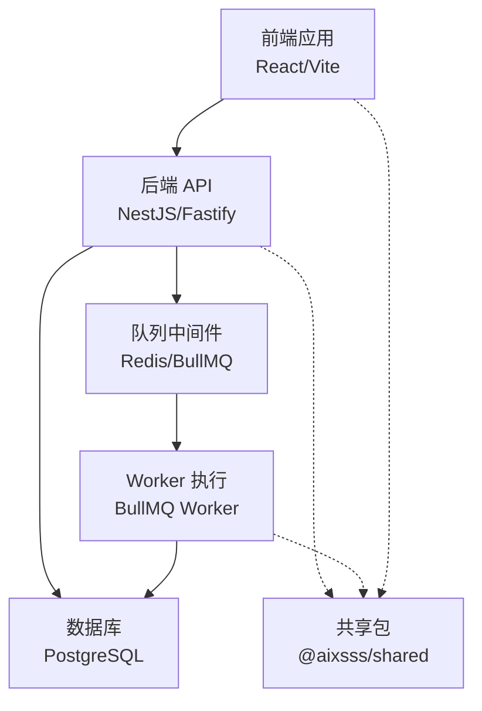
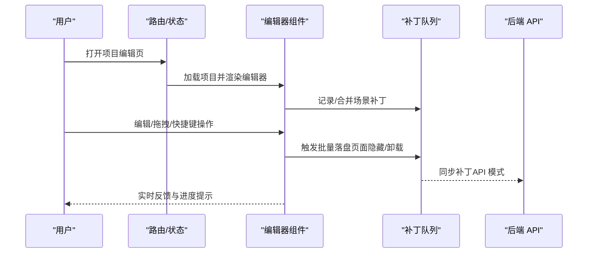
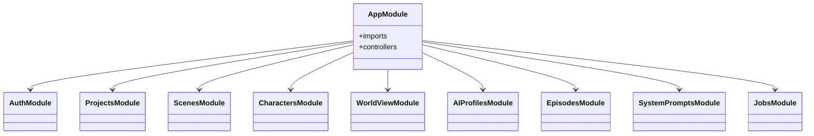
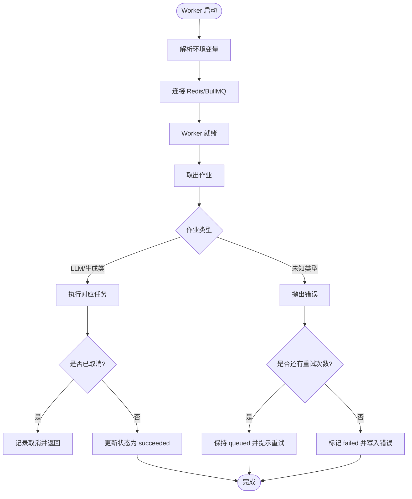
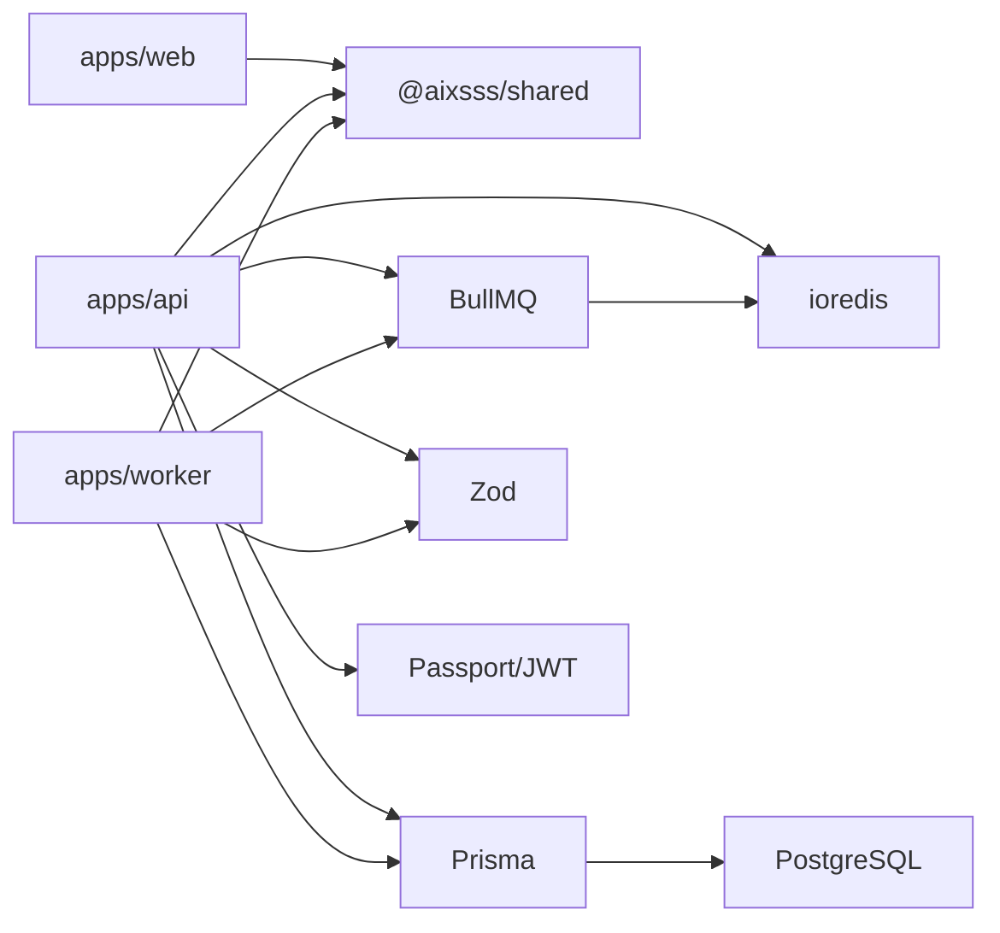

# 项目概述

<cite>
**本文引用的文件**
- [README.md](file://README.md)
- [COMMERCIAL_LICENSE.md](file://COMMERCIAL_LICENSE.md)
- [apps/api/src/main.ts](file://apps/api/src/main.ts)
- [apps/api/src/app.module.ts](file://apps/api/src/app.module.ts)
- [apps/api/src/jobs/jobs.module.ts](file://apps/api/src/jobs/jobs.module.ts)
- [apps/api/src/projects/projects.module.ts](file://apps/api/src/projects/projects.module.ts)
- [apps/api/src/ai-profiles/ai-profiles.module.ts](file://apps/api/src/ai-profiles/ai-profiles.module.ts)
- [apps/api/package.json](file://apps/api/package.json)
- [apps/web/src/main.tsx](file://apps/web/src/main.tsx)
- [apps/web/src/App.tsx](file://apps/web/src/App.tsx)
- [apps/web/src/lib/agent/graph.ts](file://apps/web/src/lib/agent/graph.ts)
- [apps/web/src/lib/workflowV2/index.ts](file://apps/web/src/lib/workflowV2/index.ts)
- [apps/worker/src/worker.ts](file://apps/worker/src/worker.ts)
- [apps/worker/package.json](file://apps/worker/package.json)
- [packages/shared/src/index.ts](file://packages/shared/src/index.ts)
</cite>

## 目录

1. [引言](#引言)
2. [项目结构](#项目结构)
3. [核心组件](#核心组件)
4. [架构总览](#架构总览)
5. [详细组件分析](#详细组件分析)
6. [依赖关系分析](#依赖关系分析)
7. [性能考量](#性能考量)
8. [故障排查指南](#故障排查指南)
9. [结论](#结论)
10. [附录](#附录)

## 引言

AIXSSS 是面向 AIGC 漫剧/短剧创作者的“创作引导系统”。其核心使命是通过“前端分镜编辑与导出 + 后端鉴权与项目存储 + Worker 执行 AI 任务”的三层架构，为用户提供从“故事构思—分镜生成—视频制作—批量优化—成品导出”的全流程自动化与可视化体验。平台强调安全与合规：浏览器侧不直接持有/调用供应商密钥，所有敏感凭证由后端加密存储并通过受控队列下发至 Worker 执行，降低泄露风险。

平台的技术愿景是以“低门槛、高扩展、强一致性”为目标，构建可演进的叙事创作基础设施：前端提供直观的画布式工作流；后端以 NestJS + BullMQ + PostgreSQL 实现鉴权、项目与分镜持久化、AI 任务编排与状态管理；Worker 专注执行各类 AI 生成与优化任务，保障任务可靠性与可观测性。

适用场景包括但不限于：

- 个人/团队进行 AIGC 漫剧/短剧的创意与制作
- 教育与研究场景中的叙事工程实践
- 企业内部门户化创作流程的标准化探索

## 项目结构

项目采用多包工作区（monorepo）组织方式，核心子项目与共享层如下：

- apps/web：React + Vite 前端应用，提供分镜编辑、工作流面板、AI 参数调节、导出与版本管理等功能
- apps/api：NestJS 后端 API，负责鉴权、项目/分镜/角色/世界观/剧集/系统提示词等资源管理，以及 AI 任务队列与工作流编排
- apps/worker：基于 BullMQ 的 Worker，执行具体的 AI 生成与优化任务，连接数据库与外部模型供应商
- packages/shared：前后端共享的类型定义与 Zod 校验模式，确保数据契约一致
- docs：工程与审计文档、迁移说明与 PRD 文档

图表来源

- [apps/api/src/main.ts](file://apps/api/src/main.ts#L9-L26)
- [apps/web/src/main.tsx](file://apps/web/src/main.tsx#L1-L37)
- [apps/worker/src/worker.ts](file://apps/worker/src/worker.ts#L44-L729)
- [packages/shared/src/index.ts](file://packages/shared/src/index.ts)

章节来源

- [README.md](file://README.md#L63-L73)

## 核心组件

- 前端编辑器与工作流
  - 画布式工作流图谱：以节点/边表达创作阶段与依赖关系，支持项目、世界设定、角色、剧集规划、单集创作、分镜生成、批量细化与导出等节点
  - 工作流 V2：提供分析、连续性、最终提示词、资产与分镜脚本等模块化能力
  - 在线/离线双模式：根据运行时模式切换 API 模式与本地模式，支持数据迁移提示
- 后端 API
  - 鉴权与权限：基于 JWT 的登录态与守卫，统一异常过滤
  - 资源域：项目、角色、世界设定、剧集、分镜、因果链版本、系统提示词、AI 配置等
  - 队列与工作流：BullMQ 队列承载 AI 任务，控制器暴露作业查询、工作流编排与 LLM 对话接口
- Worker
  - 任务执行：按作业类型路由到具体任务实现，支持进度上报、协作式取消、自动重试与状态回写
  - 安全与隔离：通过加密密钥与队列隔离，避免浏览器直连供应商密钥

章节来源

- [apps/web/src/lib/agent/graph.ts](file://apps/web/src/lib/agent/graph.ts#L1-L136)
- [apps/web/src/lib/workflowV2/index.ts](file://apps/web/src/lib/workflowV2/index.ts#L1-L9)
- [apps/web/src/App.tsx](file://apps/web/src/App.tsx#L387-L392)
- [apps/api/src/app.module.ts](file://apps/api/src/app.module.ts#L16-L35)
- [apps/api/src/jobs/jobs.module.ts](file://apps/api/src/jobs/jobs.module.ts#L1-L16)
- [apps/api/src/projects/projects.module.ts](file://apps/api/src/projects/projects.module.ts#L1-L15)
- [apps/api/src/ai-profiles/ai-profiles.module.ts](file://apps/api/src/ai-profiles/ai-profiles.module.ts#L1-L13)
- [apps/worker/src/worker.ts](file://apps/worker/src/worker.ts#L44-L729)

## 架构总览

整体架构围绕“前端画布—后端 API—队列中间件—Worker 执行—数据库/缓存”的链路展开。前端通过 REST 与 WebSocket（由框架能力支撑）与后端交互；后端将 AI 任务入队至 Redis/BullMQ；Worker 消费队列并执行具体任务，期间通过数据库记录作业状态与结果；共享包保证前后端数据契约一致。

图表来源

- [apps/api/src/main.ts](file://apps/api/src/main.ts#L9-L26)
- [apps/worker/src/worker.ts](file://apps/worker/src/worker.ts#L44-L729)
- [packages/shared/src/index.ts](file://packages/shared/src/index.ts)

## 详细组件分析

### 前端应用与编辑器

- 应用入口与路由
  - 入口初始化 QueryClient、路由与全局样式；根据运行时模式渲染本地或后端应用分支
  - 支持项目列表、编辑器路由、系统提示词页与登录页
- 编辑器与画布
  - 画布图谱定义了从“项目—世界设定—角色—剧集规划—单集—分镜—批量细化—导出”的标准流程
  - 支持键盘快捷键、主题切换、全局搜索、AI 进度提示与开发者面板
- 数据持久化与迁移
  - 页面可见性变化与卸载事件触发批量补丁落盘，避免最后一段输入丢失
  - API 模式下支持“本地数据导入云端”的迁移提示

图表来源

- [apps/web/src/App.tsx](file://apps/web/src/App.tsx#L112-L153)
- [apps/web/src/App.tsx](file://apps/web/src/App.tsx#L269-L299)

章节来源

- [apps/web/src/main.tsx](file://apps/web/src/main.tsx#L1-L37)
- [apps/web/src/App.tsx](file://apps/web/src/App.tsx#L387-L392)
- [apps/web/src/lib/agent/graph.ts](file://apps/web/src/lib/agent/graph.ts#L42-L135)

### 后端 API 与模块化设计

- 应用启动与配置
  - 基于 Fastify 适配器，启用 CORS、全局前缀与异常过滤
- 模块组织
  - 鉴权、项目、分镜、角色、世界设定、AI 配置、剧集、系统提示词、健康检查、作业与工作流等模块化拆分
- 作业与工作流
  - 作业模块提供队列提供者、服务与控制器，统一暴露 AI 作业查询、工作流编排与 LLM 对话接口

图表来源

- [apps/api/src/app.module.ts](file://apps/api/src/app.module.ts#L16-L35)
- [apps/api/src/jobs/jobs.module.ts](file://apps/api/src/jobs/jobs.module.ts#L1-L16)
- [apps/api/src/projects/projects.module.ts](file://apps/api/src/projects/projects.module.ts#L1-L15)
- [apps/api/src/ai-profiles/ai-profiles.module.ts](file://apps/api/src/ai-profiles/ai-profiles.module.ts#L1-L13)

章节来源

- [apps/api/src/main.ts](file://apps/api/src/main.ts#L9-L26)
- [apps/api/src/app.module.ts](file://apps/api/src/app.module.ts#L16-L35)

### Worker 执行与任务编排

- 启动与连接
  - 解析环境变量，建立 Redis 连接，创建 Worker 并设置并发与锁时长
- 作业处理
  - 按作业类型路由到对应任务函数，更新作业状态为 running，支持协作式取消
  - 成功后写入结果与完成时间；失败时根据重试策略决定保持 queued 或标记 failed
- 任务类型
  - 包括 LLM 对话、结构化输出、分镜生成、剧集规划、因果链构建、分镜锚点、关键帧提示/图像、动作提示、对白生成、视频生成、批量细化等

图表来源

- [apps/worker/src/worker.ts](file://apps/worker/src/worker.ts#L44-L729)

章节来源

- [apps/worker/src/worker.ts](file://apps/worker/src/worker.ts#L44-L729)

## 依赖关系分析

- 技术栈概览
  - 前端：React 18、React Router、TanStack React Query、Zustand、Radix UI、XYFlow、TailwindCSS 等
  - 后端：NestJS、Fastify、BullMQ、Prisma、Zod、Passport/JWT、ioredis 等
  - Worker：BullMQ、Prisma、Zod、dotenv、ioredis 等
  - 共享：Zod Schema、类型定义
- 关键依赖与作用
  - BullMQ：队列与作业生命周期管理，支持并发、锁、取消与重试
  - Prisma：数据库访问层，配合 PostgreSQL 存储项目、分镜、作业与配置
  - Zod：前后端数据校验与类型推断，保证契约一致
  - ioredis：Redis 客户端，支撑队列与分布式锁
  - @aixsss/shared：跨应用的数据模式与类型定义

图表来源

- [apps/api/package.json](file://apps/api/package.json#L18-L36)
- [apps/worker/package.json](file://apps/worker/package.json#L14-L22)
- [apps/web/src/main.tsx](file://apps/web/src/main.tsx#L1-L37)
- [packages/shared/src/index.ts](file://packages/shared/src/index.ts)

章节来源

- [apps/api/package.json](file://apps/api/package.json#L18-L36)
- [apps/worker/package.json](file://apps/worker/package.json#L14-L22)
- [apps/web/src/main.tsx](file://apps/web/src/main.tsx#L1-L37)

## 性能考量

- 前端
  - 路由懒加载与组件懒加载减少首屏体积
  - React Query 缓存策略与重试次数限制平衡实时性与网络压力
  - 补丁队列在页面不可见/卸载时批量落盘，避免频繁小写入
- 后端
  - Fastify 适配器提供高性能 HTTP 处理
  - BullMQ 并发与锁时长配置需结合实例规模与任务耗时调整
- Worker
  - 协作式取消与自动重试避免无效计算与前端误判
  - 锁时长与 stall 检测参数需按环境调优，防止误判与资源浪费

## 故障排查指南

- 常见问题定位
  - API 启动失败：检查端口占用、CORS 配置与环境变量
  - 队列无作业：确认 Redis 连接、队列名称与 Worker 是否正常运行
  - 作业失败：查看作业重试次数与错误消息，核对供应商密钥与网络连通性
- 日志与监控
  - Worker 输出进度与失败详情，便于快速定位
  - 前端可通过 AI 调试日志器辅助诊断
- 数据一致性
  - 作业状态写回遵循“成功写结果/失败写错误”的策略，避免前端误判

章节来源

- [apps/api/src/main.ts](file://apps/api/src/main.ts#L9-L26)
- [apps/worker/src/worker.ts](file://apps/worker/src/worker.ts#L731-L749)

## 结论

AIXSSS 以清晰的分层架构与严格的职责边界，为 AIGC 漫剧/短剧创作者提供了从“创意—生成—优化—导出”的闭环工具链。通过共享契约、队列化执行与安全的密钥管理，平台在可用性与安全性之间取得平衡。未来可在任务编排可视化、多供应商抽象与成本控制方面持续演进，进一步提升规模化与易用性。

## 附录

### 商业模式与许可证

- 默认许可证：PolyForm Noncommercial 1.0.0，允许个人/研究/学习/非商用自用
- 禁止：商业生产使用、对外提供 SaaS/托管服务、商业交付（除非获得商业授权）
- 商业授权：针对公司/组织生产使用、SaaS/托管、交付等场景提供商业许可

章节来源

- [README.md](file://README.md#L84-L92)
- [COMMERCIAL_LICENSE.md](file://COMMERCIAL_LICENSE.md#L1-L28)

### 适用场景与价值主张

- 场景：AIGC 漫剧/短剧创作、教育研究、企业内部门户化创作流程
- 价值：安全可控（浏览器不直连密钥）、可视化工作流、批量化生成与细化、版本与导出能力

章节来源

- [README.md](file://README.md#L3-L4)
