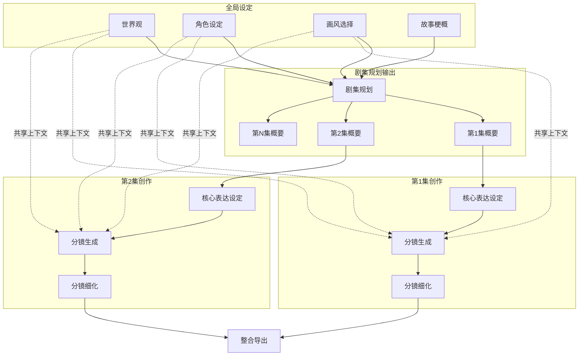

# 新增需求：剧集规划（Episode Planning）工作流（V1）

| 字段 | 值 |
|---|---|
| 文档类型 | 新增需求/技术PRD（面向 AI 工程师） |
| 适用范围 | `apps/api` / `apps/worker` / `apps/web` / `packages/shared` |
| 目标版本 | vNext（在现有“项目→分镜”MVP上扩展为“全局设定→剧集规划→单集创作→整合导出”） |
| 关键关联 | `apps/api/prisma/schema.prisma`（Project/Scene/Character/WorldViewElement/AIJob） |
| 当前现状入口 | `apps/api/src/jobs/workflow.controller.ts`、`apps/worker/src/tasks/*`、`packages/shared/src/types.ts` |

---

## 0. 背景与现状（基于当前仓库）

当前系统定位为“面向 AIGC 漫剧/短剧创作者的创作引导系统”（见 `README.md`）：

- **实体模型（服务端）**：`Project`（项目/作品）、`Scene`（分镜）、`Character`（角色）、`WorldViewElement`（世界观要素）、`AIProfile`（供应商与模型配置）、`AIJob`（队列任务与审计）。
- **工作流（当前 MVP）**：
  - 项目级状态：`ProjectWorkflowState`（见 `apps/api/prisma/schema.prisma`，同时在 `packages/shared/src/types.ts` 中有 `WORKFLOW_STATES`）。
  - AI 任务入口：`POST /workflow/projects/:projectId/scene-list` 等（见 `apps/api/src/jobs/workflow.controller.ts`），由 `JobsService` 入队，`apps/worker` 执行 `generateSceneList / generateSceneAnchor / generateKeyframePrompt / generateMotionPrompt / generateDialogue / refineSceneAll`。
  - **限制**：当前核心路径以“单个项目生成 8-12 个分镜并逐个细化”为主；缺少“剧集规划（多集结构）”这一层级，导致：
    - 无法根据**世界观复杂度/角色关系/故事体量**自动决定“需要多少集”；
    - 单集/多集的节奏、出场角色分配、承转合与悬念点缺少系统性编排；
    - 上下文复用偏“项目摘要 + 主角 + 画风”，对世界观/角色库的结构化信息利用不足（现 worker prompts 主要用 `project.summary/style/protagonist`）。

本需求在不破坏现有 MVP 可用性的前提下，新增“剧集规划”层，并将后续“分镜生成/细化”明确归属到“单集（Episode）”之下。

---

## 1. 目标（Goals）

1. **新增“剧集规划”能力**：使用“全局设定（完整）”作为输入，AI 综合分析后输出 **N 集规划**（每集概要、主要出场角色、场景范围/节奏分配）。
2. **新增“单集创作”工作流**：针对某一集，按步骤完成：
   - 核心表达设定（Core Expression）
   - 分镜生成（Storyboard/Scene List）
   - 分镜细化（沿用现有 Scene Anchor / Keyframe / Motion / Dialogue 的能力）
3. **保证上下文共享**：世界观/角色/画风作为“共享上下文”注入到“分镜生成/细化”。
4. **可回滚/可渐进**：对已有项目与现有 API/UI 最小侵入；允许以“单集模式”继续使用既有能力。

---

## 2. 非目标（Non-Goals）

- 不在本需求内实现“真正的图像/视频生成与资产存储链路”（当前系统产物仍以提示词/结构化分镜数据为主）。
- 不强制一次性把所有 worker prompt 全面改造为“严格结构化 JSON 输出”；
- 不在本需求内实现协作、多用户并发编辑冲突解决等高级能力（但需确保多租户 teamId 权限边界不被破坏）。

---

## 3. 新工作流总览（你期望的结构）

### 3.1 Mermaid（目标工作流）



### 3.2 数据流（目标语义）

```text
┌─────────────────────────────────────────────────────────────────┐
│                        全局设定 (完整)                           │
│  ┌──────────┐  ┌──────────┐  ┌──────────┐  ┌──────────┐        │
│  │  世界观   │  │ 角色设定  │  │ 画风选择  │  │ 故事梗概  │        │
│  └──────────┘  └──────────┘  └──────────┘  └──────────┘        │
└─────────────────────────────────────────────────────────────────┘
                    │ 全部作为输入
                    ▼
┌─────────────────────────────────────────────────────────────────┐
│                        剧集规划                                  │
│  AI综合分析：世界观复杂度、角色关系网、故事体量 → 规划N集         │
│  输出：每集概要 + 主要出场角色 + 场景范围                        │
└─────────────────────────────────────────────────────────────────┘
                    │
        ┌───────────┼───────────┐
        ▼           ▼           ▼
   ┌─────────┐ ┌─────────┐ ┌─────────┐
   │  第1集   │ │  第2集   │ │  第N集   │
   ├─────────┤ ├─────────┤ ├─────────┤
   │核心表达  │ │核心表达  │ │核心表达  │
   │   ↓     │ │   ↓     │ │   ↓     │
   │分镜生成  │ │分镜生成  │ │分镜生成  │◄── 全局设定作为上下文
   │   ↓     │ │   ↓     │ │   ↓     │
   │分镜细化  │ │分镜细化  │ │分镜细化  │
   └─────────┘ └─────────┘ └─────────┘
```

---

## 4. 术语与边界

| 术语 | 定义 | 在当前仓库中的近似映射 |
|---|---|---|
| 全局设定（Global Settings） | 世界观 + 角色设定 + 画风 + 故事梗概，作为全局共享上下文 | `Project` + `Character` + `WorldViewElement` + `Project.artStyleConfig/style` + `Project.summary` |
| 剧集规划（Episode Planning） | 根据全局设定拆分为 N 集的结构化规划 | 新增能力（V1） |
| 单集（Episode） | 一个独立集数的创作单元，包含概要/核心表达/分镜列表/分镜细化结果 | 建议新增 `Episode` 实体（V1） |
| 分镜（Scene） | 单集内的分镜节点（含锚点/关键帧/运动/台词等） | 现有 `Scene` 实体（需要与 Episode 建立归属关系） |
| 核心表达（Core Expression） | 单集的主题/情绪主线/冲突与转折/观众预期管理/视觉母题 | 新增能力（V1） |

**模块边界建议（实现视角）**

- `GlobalSettingsService`：聚合读取/校验全局设定（Project + Characters + WorldViewElements），并产出“可喂给 LLM 的规范化上下文”。
- `EpisodePlanningService`：生成/更新 Episode Plan（N 集概要）并落库。
- `EpisodeWorkflowService`：单集创作编排（核心表达→分镜生成→细化），对外暴露“入队接口”，对内维护状态机与幂等逻辑。
- `Worker Tasks`：每一步为一个可重试、可审计的原子任务（BullMQ job），由 `AIJob` 记录。
- `packages/shared`：新增 `Episode` 相关 types + Zod schemas，保证 web/api/worker 结构一致。

---

## 5. 功能需求（Functional Requirements）

### 5.1 全局设定（输入）

#### 5.1.1 输入项

- 世界观：0..N 个 `WorldViewElement`（已有 API：`/projects/:projectId/world-view`）。
- 角色设定：0..N 个 `Character`（已有 API：`/projects/:projectId/characters`）。
- 画风选择：`Project.artStyleConfig.fullPrompt`（优先）或 `Project.style`（兜底，见 worker 现有 `styleFullPrompt()`）。
- 故事梗概：`Project.summary`（建议作为“系列/整部作品”的梗概，而非单集摘要）。

#### 5.1.2 全局设定“可规划”校验

V1 需要最小输入门槛，避免 LLM 产出空洞规划：

- 必需：`Project.summary` 非空且 ≥ 100 字（可配置）。
- 必需：画风字段至少一个可用（`artStyleConfig.fullPrompt` 或 `style`）。
- 可选但强烈建议：至少 1 个角色；至少 1 条世界观要素（否则规划质量明显下降）。

校验失败时：

- API 返回结构化错误（BadRequest，含 `missingFields[]`），前端阻止“开始剧集规划”。

---

### 5.2 剧集规划（输出：N 集概要）

#### 5.2.1 核心行为

1. 输入：全局设定（完整） + 可选的用户偏好（如：期望集数、单集时长、面向平台等）。
2. AI 推理：综合分析 **世界观复杂度**、**角色关系网复杂度**、**故事体量** → 决定推荐集数 N，并给出理由（内部字段即可，不必强暴露到 UI）。
3. 输出：结构化的 Episode Plan：
   - `episodeCount`（推荐集数，范围建议 1..24，可配置）
   - 每集：标题/一句话梗概/主要角色/关键冲突与转折/场景范围（语义范围，不强绑定镜头号）
4. 落库：将规划结果写入 Episode 实体（或 EpisodePlan JSON）并进入“可编辑”状态。

#### 5.2.2 用户可控点（必须支持）

- 重新生成（全量）：保留历史版本（至少在 `AIJob.result` 或审计日志中可追溯）。
- 手动调整集数 N 后重新生成（可选 V1.1）：提供 `targetEpisodeCount` 覆盖推荐值。
- 单集概要可编辑：用户修改后，后续该集的“核心表达/分镜生成”必须基于最新版本（强一致）。

---

### 5.3 单集创作（每集：核心表达→分镜生成→分镜细化）

#### 5.3.1 核心表达设定（Core Expression）

输入：

- 全局设定（共享上下文）
- 当前集概要（Episode outline）
- 可选：上一集“结尾悬念/未解线索摘要”（如果存在）

输出（结构化）：

- 主题句（1 句话）
- 情绪主线（起/承/转/合）
- 核心冲突（角色/世界规则/外部事件）
- 观众预期管理（爽点/泪点/笑点/信息揭示）
- 视觉母题/重复意象（与画风一致、可在分镜生成中复用）
- 结尾落点与下一集钩子（如果该集不是最后一集）

落库位置：建议存到 `Episode.coreExpression`（JSON）并产生 `AIJob(type=generate_episode_core_expression)`。

#### 5.3.2 分镜生成（Storyboard Generation）

输入：

- 当前集的核心表达（Core Expression）
- 当前集概要
- 全局设定：世界观 + 角色 + 画风（共享上下文）

输出（最小可用）：

- 8-12 个分镜节点（每条 15-30 字，覆盖该集起承转合与视觉冲击点）

落库：

- 为该 Episode 创建或覆盖 `Scene` 列表（V1 可先用“删除后重建”的方式，参考现有 `generateSceneList` 的事务写入模式）。

#### 5.3.3 分镜细化（Storyboard Refinement）

V1 策略：尽量复用现有“单分镜细化”能力（Scene Anchor / Keyframe Prompt / Motion Prompt / Dialogue）。

关键新增点：

- 细化 prompt 的上下文来源从“Project.summary/protagonist/style”升级为：
  - 全局设定（世界观/角色库/画风）
  - 当前 Episode 的核心表达与概要
  - 当前 Scene 的摘要 + 上一 Scene 摘要（同一 Episode 内）

---

### 5.4 整合导出（跨集汇总）

导出应覆盖：

- 全局设定（世界观/角色/画风/故事梗概）
- Episode Plan（N 集概要）
- 每集：核心表达 + 分镜列表 +（可选）细化产物（锚点/关键帧/运动/台词）

V1 建议先在前端导出（复用现有导出逻辑），新增 Episode 维度即可；如需要服务端导出，可在后续新增 `GET /projects/:projectId/export?...`。

---

## 6. 数据模型（面向落库与共享类型）

### 6.1 数据库扩展建议（Prisma）

> 目标：最小破坏现有表结构的同时，为 Episode 维度提供一等公民的落库能力。

#### 方案 A（推荐）：新增 `Episode`，并给 `Scene` 增加可空 `episodeId`

新增：

- `Episode` 表：`projectId + order` 唯一；包含 `title/summary/outline/coreExpression/contextCache/workflowState` 等字段。
- `AIJob` 表增加可空 `episodeId`（用于审计与查询）。
- `Scene` 表增加可空 `episodeId`（用于归属到某一集）。

Prisma 形态示例（仅示意，字段可裁剪）：

```prisma
enum EpisodeWorkflowState {
  IDLE
  CORE_EXPRESSION_READY
  SCENE_LIST_EDITING
  SCENE_PROCESSING
  COMPLETE
}

model Episode {
  id            String             @id @default(cuid())
  projectId     String
  order         Int
  title         String
  summary       String             @default("")
  outline       Json?
  coreExpression Json?
  contextCache  Json?
  workflowState EpisodeWorkflowState @default(IDLE)
  createdAt     DateTime           @default(now())
  updatedAt     DateTime           @updatedAt

  project Project @relation(fields: [projectId], references: [id], onDelete: Cascade)
  scenes  Scene[]
  jobs    AIJob[]

  @@unique([projectId, order])
  @@index([projectId, order])
}

model Scene {
  // ... existing fields
  episodeId String?
  episode   Episode? @relation(fields: [episodeId], references: [id], onDelete: SetNull)
  // ... indexes/unique 需在实施时再评估
}

model AIJob {
  // ... existing fields
  episodeId String?
  episode   Episode? @relation(fields: [episodeId], references: [id], onDelete: SetNull)
}
```

兼容策略：

- 历史项目（只有 project→scenes）默认视为“单集项目”，在迁移脚本里为其创建 `Episode(order=1)` 并把既有 scenes 关联过去（或在查询层兜底映射）。
- 现有接口 `projects/:projectId/scenes` 可继续工作；新增接口可按 `episodes/:episodeId/scenes` 更自然。


---

### 6.2 共享类型与 Schema（`packages/shared`）

新增：

- `EpisodeWorkflowState`（类似现有 `WorkflowState`）
- `Episode` 类型与 `Create/UpdateEpisodeInputSchema`
- `EpisodePlan` 输出 Schema（用于 worker 解析与校验）
- `CoreExpression` Schema（用于 worker 解析与校验）

约束建议：

- 强制 episode 的 `order` 从 1 开始递增（前端/服务端都校验）。
- 任何“重新生成”必须带上 `sourceVersion` 或 `basedOnUpdatedAt`（乐观锁，可选 V1.1）。

---

## 7. 状态机（Workflow States）

### 7.1 项目级（Project）

保留现有 `ProjectWorkflowState`（避免破坏 UI/数据），并新增最少状态以覆盖新流程：

- `EPISODE_PLANNING`：剧集规划中（对应入队 job）
- `EPISODE_PLAN_EDITING`：用户编辑剧集规划输出
- `EPISODE_CREATING`：至少一个 Episode 进入创作（核心表达/分镜生成/细化进行中）
- `ALL_EPISODES_COMPLETE`：所有 Episode 完成（可选）


### 7.2 单集级（Episode）

建议新增 `Episode.workflowState`，最小集合：

- `IDLE`：尚未开始
- `CORE_EXPRESSION_READY`：核心表达已生成/确认
- `SCENE_LIST_EDITING`：分镜列表可编辑（与现有项目级同名状态可复用字面含义）
- `SCENE_PROCESSING`：分镜细化中
- `COMPLETE`：该集完成

---

## 8. API 设计（面向后端实现）

### 8.1 Episode 实体 API（CRUD）

建议新增：

- `GET /projects/:projectId/episodes`：列表（按 `order`）
- `POST /projects/:projectId/episodes`：创建（允许手动加集）
- `PATCH /projects/:projectId/episodes/:episodeId`：更新概要/核心表达/状态等
- `DELETE /projects/:projectId/episodes/:episodeId`：删除（受限：若已有关联 scenes，需要级联/阻止）

### 8.2 剧集规划与单集创作（Workflow/Jobs）

延续现有模式：`apps/api/src/jobs/workflow.controller.ts` 暴露 workflow endpoints → `JobsService` 写 `AIJob` 并入队 → worker 执行并回写结果。

新增 endpoints（示例）：

- `POST /workflow/projects/:projectId/episode-plan`
  - body：`{ aiProfileId: string, targetEpisodeCount?: number, constraints?: {...} }`
  - job type：`plan_episodes`
- `POST /workflow/projects/:projectId/episodes/:episodeId/core-expression`
  - body：`{ aiProfileId: string }`
  - job type：`generate_episode_core_expression`
- `POST /workflow/projects/:projectId/episodes/:episodeId/scene-list`
  - body：`{ aiProfileId: string, sceneCountHint?: number }`
  - job type：`generate_episode_scene_list`

> 细化阶段可继续复用已有 `sceneId` 级别 endpoints；仅需确保查询/上下文构建能拿到 episode 信息。

#### 8.2.1 统一返回（对齐现有 Jobs API）

建议沿用当前 `JobsService` 的返回结构：workflow 入队接口直接返回 `AIJob` 行（见 `apps/api/src/jobs/jobs.service.ts` 的 `mapJob()`），包含 `id/type/status/createdAt/...`，前端再轮询 `GET /ai-jobs/:jobId` 获取 `result/error/progress`。

#### 8.2.2 错误码约定（V1 必须）

- `400 BadRequest`：
  - 全局设定不满足“可规划”门槛（返回 `missingFields[]`）
  - `targetEpisodeCount` 超出允许范围
  - Episode 进入“生成分镜”但 `coreExpression` 缺失（若该链路强依赖）
- `404 NotFound`：
  - project/episode 不存在或不属于 teamId
- `409 Conflict`（可选 V1.1）：
  - 乐观锁失败（`basedOnUpdatedAt` 不一致），提示用户刷新后重试

---

## 9. Worker 任务设计（面向 AI 工程实现）

### 9.1 新增任务清单（V1）

| Task（job name） | 目标 | 主要输入 | 主要输出 | 落库 |
|---|---|---|---|---|
| `plan_episodes` | 生成 N 集规划 | 全局设定 | EpisodePlan JSON | Episode rows 或 Project.episodePlan |
| `generate_episode_core_expression` | 生成单集核心表达 | 全局设定 + episode outline | CoreExpression JSON | Episode.coreExpression |
| `generate_episode_scene_list` | 生成单集分镜列表 | 全局设定 + core expression | scene summaries（8-12） | Scene rows（关联 episode） |

#### 9.1.1 BullMQ job.data 约定（便于 worker 统一解析）

对齐当前 worker 解析方式（见 `apps/worker/src/worker.ts`）：

```json
{
  "teamId": "team_xxx",
  "projectId": "proj_xxx",
  "episodeId": "ep_xxx",
  "aiProfileId": "aip_xxx",
  "jobId": "aijob_xxx",
  "options": {}
}
```

> `episodeId` 对 `plan_episodes` 可为空（该任务会创建/覆盖多条 episodes）；对单集任务必须非空。

### 9.2 输出协议：强结构化 + 校验 + 自修复

- V1 推荐 EpisodePlan/CoreExpression 使用 JSON 输出，并用 Zod 校验：
  - parse 成功：写库
  - parse 失败：进入“格式自修复”：
    - 方式 1：再提示一次“只输出 JSON”（一次重试）
    - 方式 2：实现 `fixJsonOutput`（对齐现有 `apps/worker/src/tasks/formatFix.ts` 的思路）
  - 仍失败：将原始文本写入 `AIJob.result.raw`，并将 job 标记失败，前端提示用户“重新生成/调整输入”。

### 9.3 幂等与覆盖策略

建议遵循现有 `generateSceneList` 的写入模式（事务内 delete+create）并加保护：

- `plan_episodes` 覆盖策略：
  - 若用户已对 Episodes 做了大量编辑，直接覆盖会破坏劳动成果；
  - V1 建议在覆盖前要求 `force=true` 或 UI 二次确认；
  - 或采用“生成新版本”策略：保留旧版本 episodes（需要 `EpisodePlanVersion` 或软删除字段，V1 可简化为仅保留 `AIJob.result` 历史）。

- `generate_episode_scene_list` 覆盖策略：
  - 若该 episode 已有 scenes，默认覆盖（符合“重新生成分镜列表”预期），但保留旧 scenes 的导出快照（可选）。

---

## 10. Prompt Contract（关键：可落地、可测试）

### 10.1 Episode Plan（严格 JSON 输出）

#### 输入（worker 组装）

- `global.storySynopsis`：Project.summary
- `global.artStyle`：artStyleConfig.fullPrompt 优先
- `global.worldView[]`：WorldViewElements（按 order 拼接为结构化段落）
- `global.characters[]`：Characters（按更新时间/重要度排序）
- 可选：`constraints.targetEpisodeCount`、`constraints.platform`、`constraints.genre` 等

#### 输出 Schema（建议）

```json
{
  "episodeCount": 8,
  "reasoningBrief": "一句话解释为何是8集（避免长推理）",
  "episodes": [
    {
      "order": 1,
      "title": "第1集标题",
      "logline": "一句话概要",
      "mainCharacters": ["角色A", "角色B"],
      "beats": ["开场...", "冲突升级...", "转折...", "结尾钩子..."],
      "sceneScope": "主要场景范围/地点/时间段",
      "cliffhanger": "结尾钩子（若适用）"
    }
  ]
}
```

约束：

- `episodeCount === episodes.length`
- `order` 必须从 1..N 连续
- `mainCharacters` 必须来自角色库的 name（若角色库为空，可允许自由生成，但需标记 `isNewCharacter=true`，V1 可先禁止新增）

### 10.2 Core Expression（严格 JSON 输出）

```json
{
  "theme": "一句话主题",
  "emotionalArc": ["起", "承", "转", "合"],
  "coreConflict": "核心冲突描述",
  "payoff": ["爽点/泪点/笑点/信息揭示"],
  "visualMotifs": ["母题1", "母题2"],
  "endingBeat": "结尾落点",
  "nextHook": "下一集钩子（可空）"
}
```

### 10.3 Episode Scene List（可沿用现有“每行一条”或升级为 JSON）

V1 最小：沿用 `generateSceneList` 的纯文本列表格式（解析稳定、实现简单），但 prompt 必须补齐 episode 上下文。

后续可升级为 JSON（每个 scene 额外产出参与角色/地点/情绪/关键视觉点），用于更好的细化一致性。

---

## 11. 上下文工程（Context Engineering）

### 11.1 共享上下文注入策略（V1 必须）

- 分镜生成必须注入：
  - 画风 fullPrompt（稳定风格）
  - 世界观要点（按类型聚合的要点列表，控制长度）
  - 角色卡（角色名 + 关键外观/性格/关系 3-5 条要点）
  - 当前集概要 + 核心表达

### 11.2 Token 预算与压缩（建议）

- 为避免世界观/角色库过长导致 token 爆炸，新增“全局设定压缩摘要”缓存（可复用 `Project.contextCache` 思路，或新增 `GlobalEssence` 字段）：
  - 触发：用户确认全局设定后生成；任一世界观/角色/画风/梗概更新时失效并重建。
  - 产物：`{ storyCore, worldRules, characterCore, styleKeywords }`（简短、可复用）。

---

## 12. 验收标准（Acceptance Criteria）

### 12.1 功能验收（必须）

1. 在满足“可规划”校验条件下，调用 `POST /workflow/projects/:projectId/episode-plan` 能产生可解析的 Episode Plan，并落库可查询。
2. 至少支持对任意 Episode：
   - 生成核心表达（可解析 JSON，落库）
   - 生成分镜列表（8-12 条，落库为 Scene，且与 episode 关联）
3. 对已有项目（无 episode 数据）不破坏现有“生成分镜列表/细化分镜/导出”路径。

### 12.2 质量与稳定性（建议指标）

| 指标 | 口径 | 目标 |
|---|---|---|
| EpisodePlan 解析成功率 | 首次 JSON.parse + schema 校验通过 | ≥ 95% |
| EpisodePlan 自修复后成功率 | 触发 `fixJsonOutput`（或二次提示）后最终通过 | ≥ 99% |
| CoreExpression 解析成功率 | 同上 | ≥ 98% |
| 单次任务耗时 | `startedAt → finishedAt`（`AIJob`） | 可观测 + 可分布分析 |
| Token 使用 | `AIJob.result.tokenUsage.total` | 可观测 + 可按 team/项目汇总 |
| 幂等性 | 重试/重复入队不产生重复 Episode/Scene | 必须通过 |

---

## 13. 实现改动点清单（Implementation Delta）

> 用于工程落地时快速定位改动面；不要求一次性全部完成，可按里程碑拆分。

### 13.1 数据库与共享类型

- `apps/api/prisma/schema.prisma`：
  - 新增 `Episode`（或 EpisodePlan JSON 字段，推荐 `Episode`）
  - `Scene` 增加 `episodeId`（可空，便于兼容）
  - `AIJob` 增加 `episodeId`（可空，便于审计）
  - `ProjectWorkflowState` 增加 episode 相关状态（若采用状态机方案）
- `packages/shared/src/types.ts`：新增 `EpisodeWorkflowState`（以及 project 新状态若需要）
- `packages/shared/src/schemas/*`：新增 `episode.ts`（Episode CRUD + plan/core schemas）并在 `packages/shared/src/schemas/index.ts` 导出
- `apps/web/src/lib/workflowLabels.ts`：新增状态对应中文标签（避免 UI 显示 raw enum）

### 13.2 API（NestJS）

- 新增 `apps/api/src/episodes/*`（建议独立模块）：
  - CRUD：`GET/POST/PATCH/DELETE /projects/:projectId/episodes`
- 扩展 `apps/api/src/jobs/workflow.controller.ts`：
  - 新增 `episode-plan/core-expression/scene-list` endpoints
- 扩展 `apps/api/src/jobs/jobs.service.ts`：
  - 新增 enqueue 方法并写入 `AIJob(type=...)`
  - 新增 requireEpisode（类比现有 requireScene）

### 13.3 Worker（BullMQ）

- 新增任务文件（示例）：
  - `apps/worker/src/tasks/planEpisodes.ts`
  - `apps/worker/src/tasks/generateEpisodeCoreExpression.ts`
  - `apps/worker/src/tasks/generateEpisodeSceneList.ts`
- 更新 `apps/worker/src/worker.ts`：
  - switch-case 增加 `plan_episodes/generate_episode_core_expression/generate_episode_scene_list`
- 可选：新增 `fixJsonOutput`（类比 `apps/worker/src/tasks/formatFix.ts`）并复用 tokenUsage 合并逻辑

### 13.4 Web（仅列出对 AI 相关链路的必要改动）

- 新增“剧集规划/单集选择/单集创作步骤”UI（或先以“只读查看规划结果”落地）
- 导出模块（现前端导出）新增 Episode 维度

---

## 14. 可观测性与审计（Observability & Audit）

- `AIJob.result` 建议最小包含：
  - `tokenUsage`（对齐现有 worker 返回）
  - `raw`（原始文本，便于追溯与调参）
  - `parsed`（结构化 JSON，便于前端直接消费）
  - `meta`：`provider/model/promptVersion/inputHash`（可选）
- `job.updateProgress({ pct, message })`：
  - 为三类新任务定义统一 progress 分段（准备提示词→调用→解析→写库→完成），便于前端复用进度组件
- 审计边界：
  - `AIProfile.apiKeyEncrypted` 仅在 worker 解密使用（延续现有设计）
  - 不在日志/审计中落明文 key

---

## 15. 风险与开放问题（AI 工程重点）

- **结构化输出稳定性**：不同供应商/模型对 JSON 严格度不同，需要 `fixJsonOutput` 与 schema 校验。
- **上下文爆炸**：世界观/角色库长度不可控，必须有压缩/裁剪策略与缓存失效机制。
- **覆盖与版本**：重新生成可能覆盖用户编辑成果，需要明确“覆盖策略/版本留存”。
- **跨集一致性**：后续应考虑“上一集摘要/未解线索”作为 episode 输入的一部分（V1 可先弱化）。

---

## 16. 里程碑建议（可执行分期）

- V1.0（本需求范围）
  - EpisodePlan / CoreExpression / EpisodeSceneList 三类任务全链路（API 入队 + worker 执行 + DB 落库 + UI 可查看）
  - 分镜细化继续沿用 scene 级任务（可不强制注入全局设定）
  - 分镜细化 prompts 注入结构化角色/世界观
  - 上下文缓存与失效策略落地
  - Episode 层批量细化编排（可选）
